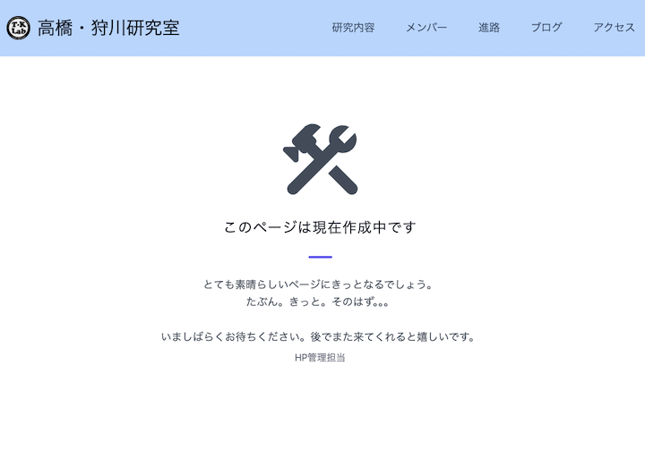

# お待たせしました

## お待たせしすぎたかもしれません

**ついに認知グループの研究紹介ページが追加されました！**
もうあの『このページは現在作成中です』とはお別れです…
少し寂しい気もしますが、ホームページが充実するのはいいことですね！

###### 見納め

# 認知グループと社会受容グループ統合

ホームページを訪れたことがある方は気づいたかもしれませんが、社会受容グループが人数の減少に伴い、**認知グループに統合されました**。
統合はされたものの、今までの研究内容等は認知グループで継続していきます！
~~再び勢力拡大して独立を目論んでいると言う噂があったりなかったり~~

元社会受容グループが行なっていた研究の概要についても認知グループの研究紹介内に記載されていますので、ぜひ確認してください！

# ちなみに

早速[ページ](https://www.takahashi.qse.tohoku.ac.jp/research/cognitive/index.html)を確認していただけた方は気づいたかもしれませんが、ページデザインが**航空グループの丸パクリ**です。
取り急ぎ内容だけ掲載とのことだったので、仕方ありませんが、いつか必ず別デザイン化します。
