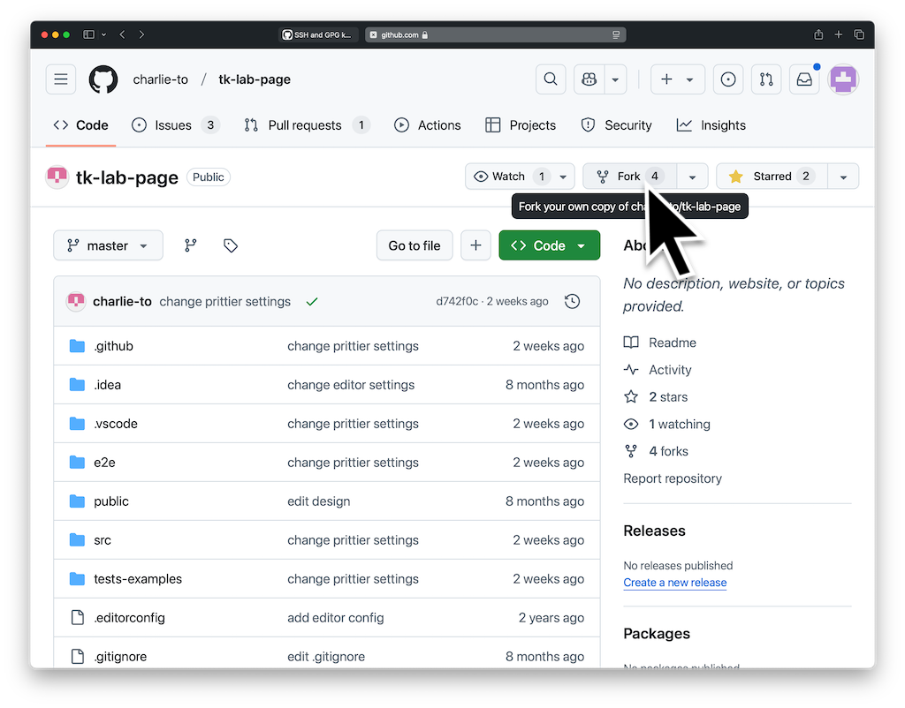
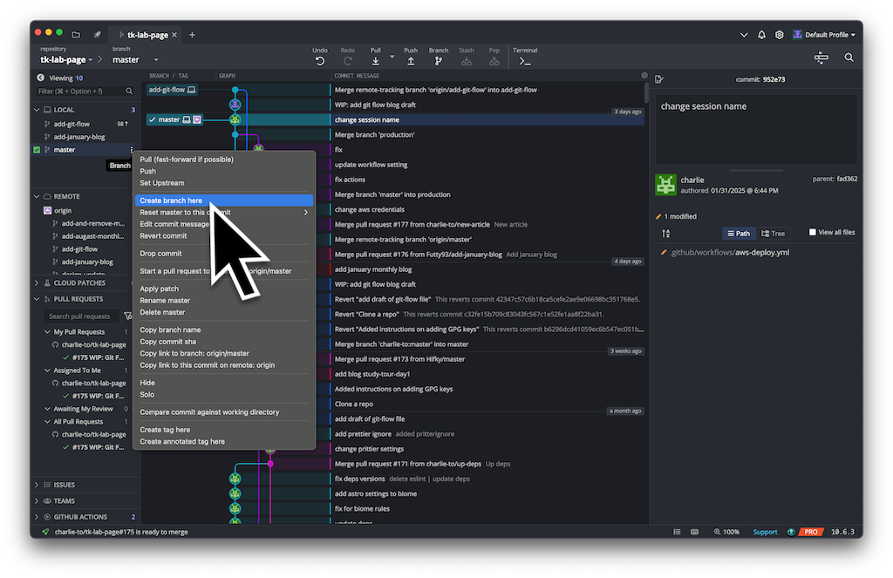

> [!CUSTOM] blue copilot はじめに
> 高橋・狩川研究室のホームページのソースコードはGitHubで管理されています。
> 自分のパソコンでソースコードを更新して、GitHubに反映する方法を説明します。
> また、高橋狩川研究室のホームページ更新ではGitKrakenの利用を推奨しています。
> このブログではGitKrakenを利用した方法を説明しますが、他の方法でGithubへ反映する方法を利用しても大丈夫です。

# GitKrakenのインストール
1. [GitKraken公式サイト](https://www.gitkraken.com/)にアクセスします。
2. ダウンロードページから、自分のOS（Windows、Mac、Linux）に合ったインストーラーをダウンロードします。
3. インストールウィザードに従ってインストールを完了させます。
- インストール中にアカウント登録を求められる場合があります。GoogleアカウントやGitHubアカウントを使って登録すると簡単です。

---

# GitHubアカウントの作成
もしGitHubアカウントを持っていない場合は、以下の手順で作成してください。
1. [GitHub公式サイト](https://github.com/)にアクセスします。
2. 「Sign up」ボタンをクリックし、必要な情報（メールアドレス、パスワードなど）を入力してアカウントを作成します。

---

# 大元のリポジトリをフォーク
ホームページ管理係が管理している大元となるリポジトリを自分のGithubにフォーク(コピーを作成)します。
1. 大元のリポジトリをブラウザで開きます。(URL等はホームページ管理係に確認してください)
2. 画面右上部にあるForkをクリックします。
   
3. Create先のOwnerとして自分のアカウントを選択してください。
4. Create forkをクリックし、自分のリポジトリに`tk-lab-page`が追加されたことを確認してください。

---

# リポジトリのクローン
GitKrakenを使って研究室のホームページのソースコードを取得（クローン）します。
1. GitKrakenを起動します。
2. 左側のメニューから「Clone a Repo」を選択します。
   
3. 「Where to clone to」 に自分のパソコン内の保存したい場所を入力してください。
4. 「Repository URL」に、先ほど作成した`自分のGitHubリポジトリURL`を入力します。
- 例: `https://github.com/username/tk-lab-page.git`
  
5. **`Create the repo!`** をクリック。
- 左下にローディングが表示されるので、終わるまで待ちます。
  
6. クローンが完了したら、Open Nowをクリックします。Git KrakenにGRAPHが表示されたら完了です。
   
   

---

# GPGキーの設定
GitHubでは、セキュリティを向上させるためにGPGキーを利用することが推奨されています。ホームページ管理係でもGPGキーの登録を推奨しています。
本ブログではGitKrakenを利用してGPGキーを生成する方法を紹介します。自分でGPGキーを生成する場合には[GitHubのGPGキーガイド](https://docs.github.com/en/authentication/managing-commit-signature-verification/generating-a-new-gpg-key)に従って、GPGキーを生成し、GitKrakenにGPGキーを追加してください。
## GPGキーの生成
1. GitKrakenの右上の歯車マークから設定(Preferences)を開き、左のリストから `Comit Signing` を選択します。
4. 「GPG Format」は`OPENPGP`を選択し、「GPG Program」には`gpg`と表示されていることを確認してください。表示されない場合には入力してください。
5. 「Signing Key」はすでにGPGキーを生成している場合に選択する部分です。今回は新たに生成するため、`None`のまま進めます。
6. **`Generate`** をクリックすると新たなGPGキーが生成されます。生成されると「Signing Key」に自動的に生成されたキーが選択されます。
   
## GithubへGPGキーの登録
1. 自身のパソコンのコマンドラインを立ち上げてください。MacOSであれば標準で`Terminal`が用意されています。
2. 次のテキストを入力してください。
  ```Shell
  gpg --list-secret-keys --keyid-format=long
  ```
エンターキーを押すと次のような表示が出ることを確認してください。
  ```Shell
  $ gpg --list-secret-keys --keyid-format=long
  /Users/hubot/.gnupg/pubring.kbx
  ------------------------------------
  sec   rsa4096/3AA5C34371567BD2 2025-01-09 [SC] [expires: 2027-01-09]
  uid                          [ultimate] Futty93 <yamada.taro.b8@dc.tohoku.ac.jp>
  ssb   rsa4096/4BB6D45482678BE3 2025-01-09 [SEA] [expires: 2027-01-09]
  ```
作成したGPGキーのリストが表示されるため、複数のGPGキーが存在する場合には、GitKrakenで生成したものを選択し、GPGキーIDをコピーします。
この例ではGPGキーIDは`3AA5C34371567BD2`です。
3. 次のテキストを入力してください。ただし`3AA5C34371567BD2`は自分のものに変更してください。
  ```Shell
  gpg --armor --export 3AA5C34371567BD2
  ```
エンターキーを押すと次のような長い文字列が表示されます。
  ```Shell
  -----BEGIN PGP PUBLIC KEY BLOCK-----
  
  navlauihvangnvae;vasdkjvna;kvbKKDFNK+VDSKHKGNVjvnglghva;unvNv
  agvaer/gaLGVMEg/,abJEgve/gambael;zugajrgaeorgma?avaierab/sghh
  Qr2948qtb+KGagnoaer
  =jFro
  -----END PGP PUBLIC KEY BLOCK-----
  ```
出力されたテキストを`-----BEGIN PGP PUBLIC KEY BLOCK-----`から`-----END PGP PUBLIC KEY BLOCK-----`を含んですべてコピーしてください。
4. Githubで右上の自分のアイコンをクリックし`Settings`を選択します。
5. 左側のリストから`SSH and GPG keys`を開いてください。
6. 「GPG Keys」の`New GPG key`をクリックし、「Title」は任意のものを入力し、「Key」には先ほどコピーしたテキストをペーストし、`Add GPG key`をクリックします。
7. 一覧に追加したGPGキーが表示されていれば完了です。

---

# ブランチの作成
ホームページの変更作業を安全に行うために、新しいブランチを作成しましょう。ブランチを使うことで、作業中の変更が本体（masterブランチ）に直接影響を与えることなく進められます。

## ブランチの作成手順
1. **masterブランチに移動する**  
   GitKrakenでは、左側の一覧から`master`をダブルクリックすると簡単に移動できます。
2. **新しいブランチを作成する**  
   masterブランチを選択した状態で、右側のメニューをクリックし、`Create branch here`を選択します。
3. **ブランチ名を設定する**
  - ブランチ名はすべて小文字にし、スペースの代わりに`-`を使用します。
  - どのような作業を行っているのかが分かる名前にしましょう。
  - 例: `feature/update-homepage` や `add-june-blog`




---

# ソースコードの編集とコミット
作業ブランチを作成したら、実際にソースコードを編集し、変更を記録（コミット）しましょう。

## コードの編集と変更確認
1. **ローカルフォルダ内で必要な変更を行う**  
   GitKrakenに戻ると、編集したファイルの一覧が右側に表示されます。
2. **変更内容を確認する**  
   変更したファイルを選択すると、どこを編集したのかが表示されます。
  - **新しく追加した部分は緑**、**削除した部分は赤**でハイライトされます。


## 変更をステージングする
3. **変更内容を確認し、ステージに追加する**  
   編集が正しいことを確認したら、`Stage File`をクリックします。
  - ステージに追加したファイルのみ、次のコミット時に記録されます。


## コミットの作成
4. **コミットメッセージを入力する**
  - `Commit summary`（コミットの概要）は**必須入力**です。
  - `Description`（詳細説明）は任意ですが、他の人が変更内容を理解しやすくなるので、できるだけ書くことをおすすめします。
5. **`Commit Changes`ボタンを押してコミットする**


## 変更をリモートにプッシュする
6. **変更をリモートリポジトリにプッシュする**
  - コミットした変更をリモートリポジトリに反映させるため、`Push`ボタンをクリックします。


これで、作業内容の保存とリモートへの共有が完了しました。
次にプルリクエストを作成します。

---

# プルリクエストの作成
ブランチでの変更を本体に統合してもらうため、プルリクエストを作成しましょう。

## プルリクエストの作成手順
1. **GitHubで対象のリポジトリを開く**  
   ブラウザで**自分のGitHubの`tk-lab-page`**を開きます。画面上部に「変更がプッシュされた」旨が表示されるので、`Compare & pull request`をクリックします。


2. **送信元と送信先を確認する**
  - 送信元（自分のブランチ）と送信先（管理者の`master`ブランチ）が正しいことを確認します。

3. **変更内容をチェックする**
  - 画面下部に表示されている変更内容が正しいか確認します。
  - **意図しないファイルや変更が含まれていないか注意しましょう。**


4. **プルリクエストを作成する**
  - 必要であれば説明を追加します。
  - `Create pull request`を押して完了です。

これでプルリクエストの作成が完了しました。

---

上記はあくまでもホームページのソースコードを変更するための初歩的な方法の１つです。
Github及びGitKrakenにはもっと便利な機能がたくさんあります。
勉強して損することはないと思いますので、ぜひ自分で調べて色々試してみてください！


