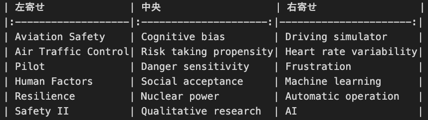

最終更新日: 2024/5/23

研究室内のブログでは実はさまざまなMarkdown記法が利用可能です。
この記事を参照しながら色々利用してみてください！

> [!IMPORTANT]
> このブログでは研究室のブログで利用できる記法のみを記載しています。
> より一般的なマークダウンの記法については
> [Qiita "Markdown記法 チートシート"](https://qiita.com/Qiita/items/c686397e4a0f4f11683d)を確認してください。


# テキストの装飾
ブログ内でテキストの見た目や構造を定義するための記法について紹介します
## 見出し
研究室ブログでは当然ですが、見出しタグを利用することができます。
また見出しタグを検出して目次を生成しているため、適切に見出しを利用することはとても大切です。
階層に応じてh1 ~ h6まで利用可能です。

```md
# これはh1タグです
## これはh2タグです
###### これはh6タグです
```
> [!NOTE]
> ※ #の後ろに半角スペースが必要です。

**出力**
<h1>これはh1タグです</h1>
<h2>これはh2タグです</h2>
<h6>これはh6タグです</h6>

## 強調・強勢
*強調*　**強勢**
```md
_ か * で囲むとHTMLのemタグになります。ここでは *italic type* になります。
__ か ** で囲むとHTMLのstrongタグになります。ここでは **太字にアンダーライン** になります。
```
**出力**
_ か * で囲むとHTMLのemタグになります。ここでは *italic type* になります。
__ か ** で囲むとHTMLのstrongタグになります。ここでは **太字にアンダーライン** になります。

## 打ち消し線
~~打ち消し~~
```md
打ち消し線を使うには ~~ で囲みます。 ~~打ち消し~~
```

**出力**
打ち消し線を使うには ~~ で囲みます。 ~~打ち消し~~

## 折りたたみ
このブログではHTMLを直接書き込むことができます。
一例として折りたたみを紹介します。

```html
<!-- open属性なし -->
<details><summary>サンプルコード（open属性なし）</summary>

初期状態では閉じています
</details>

<!-- open属性あり -->
<details open><summary>サンプルコード（open属性あり）</summary>

初期状態で開いています
</details>
```
**出力**
<!-- open属性なし -->
<details><summary>サンプルコード（open属性なし）</summary>

初期状態では閉じています
</details>

<!-- open属性あり -->
<details open><summary>サンプルコード（open属性あり）</summary>

初期状態で開いています
</details>

## 補足・注意・警告
> [!NOTE]
> 補足などのメッセージ

> [!TIP]
> tipのメッセージ

> [!IMPORTANT]
> 重要なメッセージ

> [!WARNING]
> 警告のメッセージ

> [!CAUTION]
> より強い警告のメッセージ 

### ノート記法内でのMarkdown記法の使用
現在ノート記法内でサポートしているMarkdown記法は以下となっています。

* リスト
* 強調
* 打ち消し線
* コードスパン
* リンク
* 画像
* コードブロック


# リスト
このブログではリストも利用可能です。
## 順序なしリスト(箇条書きリスト)
* 文頭に`*` `+` `-`のいずれかをつけると順序なしリストとなります。
  * ネストすることも可能です。

## 順序ありリスト
1. 文頭に`数字 + .`をつけることで順序付きリストとなります。
   1. ネストすることも可能です。

適切にインデントを入れることで次のようなリストも作成可能です。
1. 番号付きリスト
2. 番号付きリスト
   1. ネストされた番号付きリスト
   2. ネストされた番号付きリスト
      * こんなこともできる
   3. ネストされた番号付きリスト
3. 番号付きリスト

## 説明付きリスト
HTMLを直接書き込むことで説明付きのリストも作成可能です。
```html
<dl>
  <dt>高橋先生</dt>
  <dd>教授</dd>
  <dt>狩川先生</dt>
  <dd>准教授</dd>
</dl>
```
**出力**
<dl>
  <dt>高橋先生</dt>
  <dd>教授</dd>
  <dt>狩川先生</dt>
  <dd>准教授</dd>
</dl>

## チェックボックス
順序なしリストの記号の後に`[ ]`を入力することで チェックボックスも利用できます。
`[x]`とすることでチェックが入ったチェックボックスにできます。
```md
- [ ] タスク1
- [x] タスク2
```
**出力**
- [ ] タスク1
- [x] タスク2

# リンク
URLを埋め込んだ文字リンクを作成することができます。
```md
[高橋・狩川研究室](https://www.takahashi.qse.tohoku.ac.jp)
```
**出力**
[高橋・狩川研究室](https://www.takahashi.qse.tohoku.ac.jp)

またカーソルを乗せることで表示されるタイトルを指定することもできます。
```md
[高橋・狩川研究室](https://www.takahashi.qse.tohoku.ac.jp "高橋・狩川研究室のホームページです")
```
**出力**
[高橋・狩川研究室](https://www.takahashi.qse.tohoku.ac.jp "高橋・狩川研究室のホームページです")

また次のようにすることでリンクを使い回すことが可能です。

```md
[ここ][tk-link] と [この][tk-link] リンクは同じになります。
[tk-link] という書き方もできます。
　
[tk-link]: https://www.takahashi.qse.tohoku.ac.jp
```
**出力**
[ここ][tk-link] と [この][tk-link] リンクは同じになります。
[tk-link] という書き方もできます。

[tk-link]: https://www.takahashi.qse.tohoku.ac.jp

# 画像
画像も利用することが可能です。
画像は基本的には他のブログで使いまわすことがないので、整理の観点から`blog.md`と同一のディレクトリに格納してください。
```md
## タイトルありの画像を埋め込む


## タイトル無しの画像を埋め込む

```
**出力**

基本的には画像は要素いっぱいに拡大して表示されます。
サイズを指定したい場合にはHTMLを直接埋め込みます。

```html

```
**出力**


# 脚注
```md 書き方
文章中に`[^1]`のように記述し、脚注のリンク[^1]を作成することができます。数字ではなく文字列でも可能です。

[^1]: 上付き文字がここへのリンクとなります。
```
**結果**
文章中に`[^1]`のように記述し、脚注のリンク[^1]を作成することができます。数字ではなく文字列でも可能です。

[^1]: 上付き文字がここへのリンクとなります。

> [!NOTE]
> 脚注は必ずしも文末にまとめて書く必要はありません。どこに書いてもブログ上では最末尾に表示されます。

# コード
ブログの文中にコードを埋め込むことができます。
## インラインコード
文章中にコードを表示するものです。強調と同じような使い方も可能です。
インラインにしたい部分を`` ` ``(バッククオート)で囲みます。
```md
`print("Hello, World!")`
```
**出力**
`print("Hello, World!")`

インラインコード内でバッククオートを利用したいときは、利用したいバッククオートとは異なる数の`` ` `` で囲います
```md
` `` ` や `` ` `` や ``` `` ``` など
```
**出力**
` `` ` や `` ` `` や ``` `` ``` など

## コードブロック
実はすでに上でいくつも登場していますが、コードプロックを挿入することも可能です。
~~~md
```
`や~を利用して囲むことでコードブロックを挿入できます。
```
~~~
**出力**
```
`や~を利用して囲むことでコードブロックを挿入できます。
```
### シンタックスハイライト
コードブロック内に記述している言語を指定することで、シンタックスハイライトを利用できます。
> [!Warning]
> 現状なぜかインデントを反映することができません。コードを書く際にはしっかりインデントしましょう。
~~~
```c multiply.c
#include <stdio.h>

// 掛け算を行う関数
int multiply(int a, int b) {
    return a * b;
}

int main() {
    int num1, num2, result;

    // ユーザーから2つの整数を入力
    printf("Enter two integers: ");
    if (scanf("%d %d", &num1, &num2) != 2) {
        printf("Invalid input.\n");
        return 1; // エラーコードを返す
    }

    // 掛け算を行う関数を呼び出し
    result = multiply(num1, num2);

    // 結果を出力
    printf("The result of %d * %d is %d\n", num1, num2, result);

    return 0;
}
```
~~~
**出力**
```c multiply.c
#include <stdio.h>

// 掛け算を行う関数
int multiply(int a, int b) {
    return a * b;
}

int main() {
    int num1, num2, result;

    // ユーザーから2つの整数を入力
    printf("Enter two integers: ");
    if (scanf("%d %d", &num1, &num2) != 2) {
        printf("Invalid input.\n");
        return 1; // エラーコードを返す
    }

    // 掛け算を行う関数を呼び出し
    result = multiply(num1, num2);

    // 結果を出力
    printf("The result of %d * %d is %d\n", num1, num2, result);

    return 0;
}
```
### 編集差分の表示
言語を指定していた部分に`diff`と記述し、半角スペースをあげて言語を指定することで、編集差分の表示を行うことができます。
行の先頭に`+`, `-`を書きます。
~~~
```diff lang="js"
- const nextPageUrl = '../slide23.html';
+ const nextPageUrl = '../slide23/index.html';
```
~~~
**出力**
```diff lang="js"
- const nextPageUrl = '../slide23.html';
+ const nextPageUrl = '../slide23/index.html';
```

# 水平線
任意の位置に線を入れることができます。
```md
* * *
***
*****
- - -
--------------------------------------
```
**出力**
* * *
***
*****
- - -
--------------------------------------

# 表(テーブル)
ブログ中に表を挿入することができます。
また`:`を利用することで、左寄せ・中央・右寄せを指定できます。
```md
| 左寄せ              | 中央                   | 右寄せ                 |
|:-------------------|:---------------------:|----------------------:|
| Aviation Safety    | Cognitive bias        | Driving simulator     |
| Air Traffic Control| Risk taking propensity| Heart rate variability|
| Pilot              | Danger sensitivity    | Frustration           |
| Human Factors      | Social acceptance     | Machine learning      |
| Resilience         | Nuclear power         | Automatic operation   |
| Safety II          | Qualitative research  | AI                    |
```
| 左寄せ | 中央 | 右寄せ |
|:-|:-:|-:|
| Aviation Safety | Cognitive bias | Driving simulator |
| Air Traffic Control| Risk taking propensity| Heart rate variability|
| Pilot | Danger sensitivity | Frustration |
| Human Factors | Social acceptance | Machine learning |
| Resilience | Nuclear power | Automatic operation |
| Safety II | Qualitative research | AI |

ちなみに人間が見やすい以外のメリットはありませんが、このように見た目を揃えても出力には影響を与えません。


# こいつらいつ使うん埋め込み集
HTMLに埋め込めるものは基本的にはブログ内で利用することができます。
[こちらのブログ](/blogs/dev/markdowncanembed/blog/index.html "こいつらいつ使うん埋め込み集")に代表例をまとめましたので、確認してみてください!
