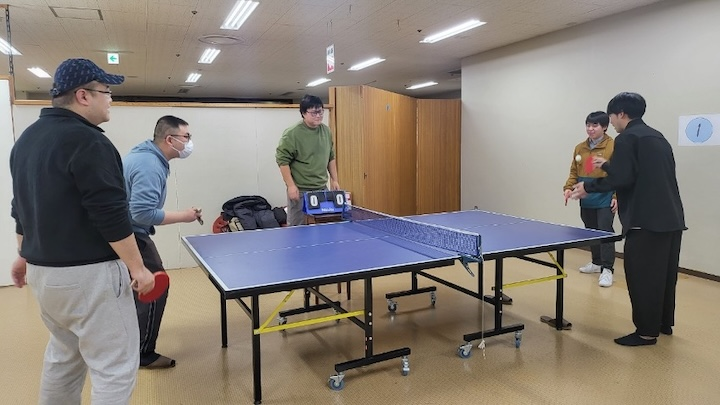
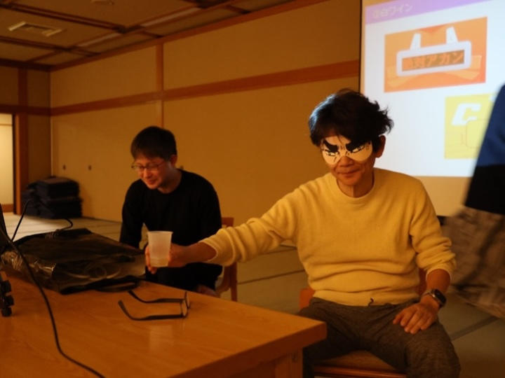
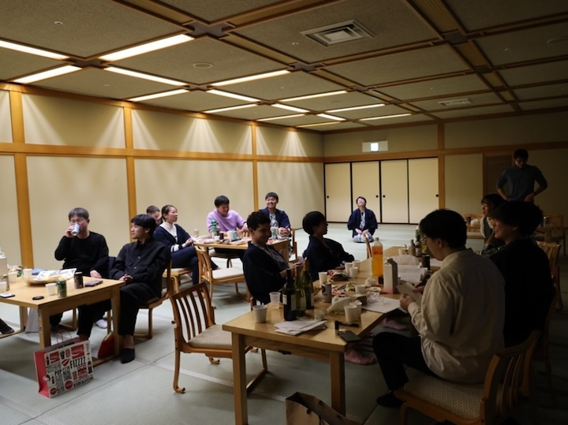

# あいさつ

ブログ係の嶋貫です。3月に入って暖かくなってきたので、エアコンの動かない研究室も段々と過ごしやすくなってきましたね。新体制の高橋・狩川研究室となり、心機一転してブログ係を頑張りたいと思います。

# 毎年恒例！忘年会！

さて
イベントが大好きな高橋・狩川研究室では毎年年末に、一泊二日の忘年会を実施しています！
今年度は、蔵王温泉！！（3回目）
毎年行き先が同じなのは何回も行くほど魅力的な場所なだけで
決して準備が面倒臭いわけではありません！！

## ZAOバーガー　ZAOBOO

1日目の日中は、班ごとに分かれて各々好きな観光地へ観光しに行きました。
私のいた班は、食にうるさい人が多かったので蔵王名物のZAOバーガーを食べに「ZAOBOO」へ伺いました。
ハワイっぽさのある雰囲気のお店で、分厚いパティのハンバーガーは肉汁が半端ないです！！来年もぜひまた行きたいですね！

###### #ZAOバーガー美味しかった

## ホテル到着

観光を終えた後、今年度もアクティブリゾート宮城蔵王さんに宿泊させていただきました。アクティブリゾート宮城蔵王さんは綺麗な蔵王温泉と美味しい料理、卓球とゲームコーナーもあるのでここ三年間ずっと利用させていただいています！
　遅発組が合流するまで、温泉や卓球で過ごし、

###### #卓球なう

# 食事会からの2次会！

全員が合流したところで食事会！！

今年も美味しい料理が並びました！

その後、宴会場へ移動して二次会へ

### プレゼント交換

二次会では毎年恒例のプレゼント交換、それに加えて今年はB4が企画してくれた格付けチェック、原武王を楽しみました！!

###### #いい笑顔

今年のプレゼントのテーマが二刀流と難しいお題なこともあってみんな例年以上に悩んでましたね。

### 格付けチェック

毎年恒例になりつつある格付けチェックでは、ワイン、絵画、唐揚げ、コーヒーの4つの項目で格付けを行い、唐揚げでは、まさかのカエル肉で作った唐揚げと鳥の唐揚げとの食べ比べ！！

ところがカエル肉が意外と好評で一番の難問だったみたいです
今年の格付け豪華すぎる。

###### #やっぱり教授は強かった。

### クイズ！HARATAKE王

最後にM2の先輩方の原武さんへの愛を確かめるべく、原武さんにまつわるクイズ原武王を行い、恥ずかしがる原武さんのリアクションを楽しみました。
正答率は、、、言えません

###### #普通に歓談もする

# おわりに

今年は天候にも恵まれて、B4が企画、運営を頑張ってくれたおかげで本当に楽しい旅行になりました！！
　コロナが流行している時期には忘年会もできなかったそうなので、今忘年会を楽しめることに感謝ですね。

