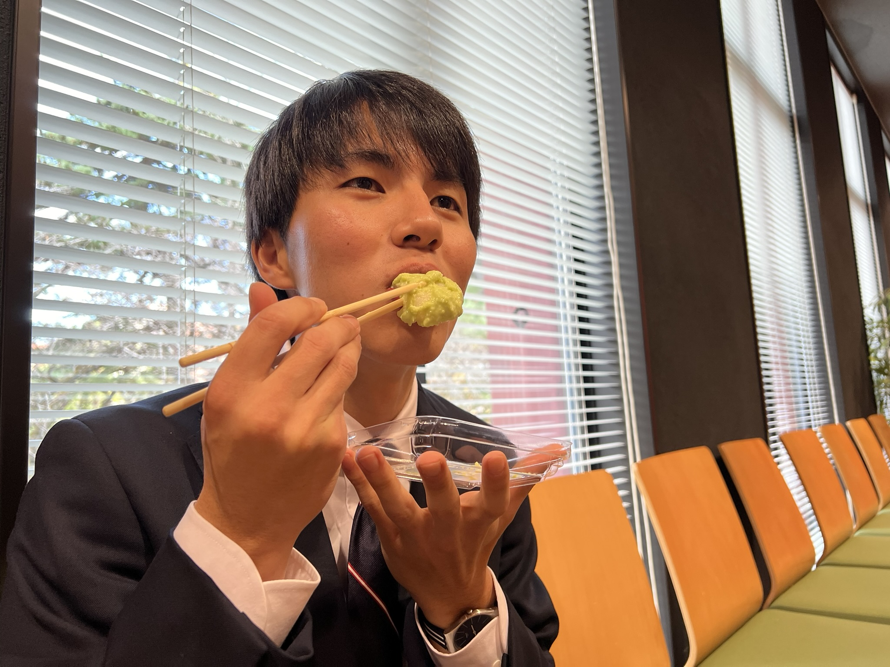

# 研究交流会に参加しました

日本原子力学会東北支部会研究交流会に参加しました。
本研究室からは伊東くん、椎野さんが参加しました。
伊東くんは初めてのポスターセッションを頑張っていました。[^1]

[^1]:各方面に配慮し、ポスターはモザイク加工してあります。

# 誕生日に学会

伊東くんは今日がお誕生日でした。
休憩時間に買ってきた村上屋のお餅をお誕生日プレゼントとして渡しました。
発表後の緊張から開放されてこの表情。
とても美味しそうに食べてくれました。

# お疲れ様でした！

発表後の準備から学会の参加まで、卒論や修論で忙しい中で行うことは大変だったと思います。
お二人ともお疲れ様でした！
