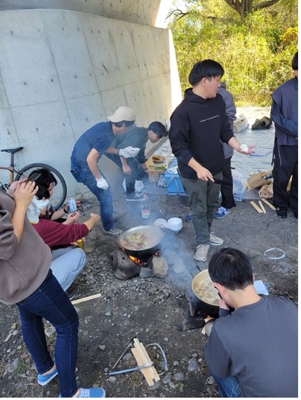
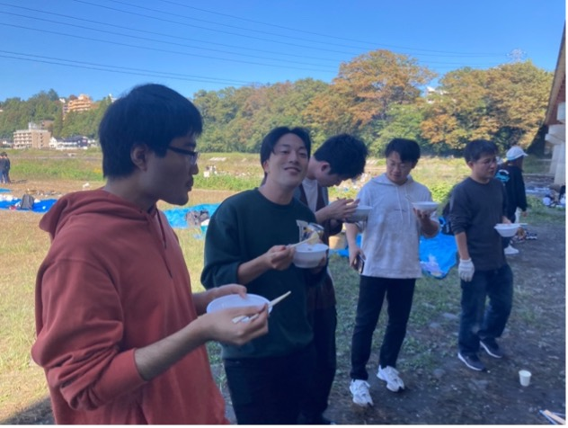
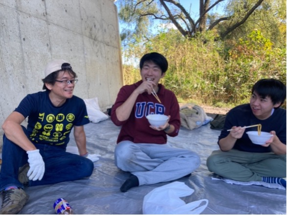
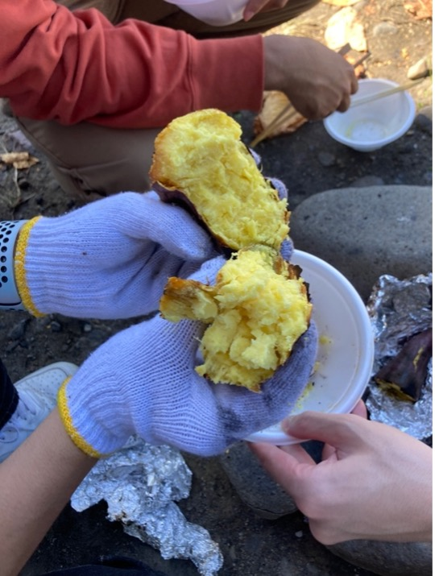

# 芋煮会を今年も行いました！

高橋狩川研究室恒例行事！芋煮会を今年も行いました！
お久しぶりかもしれません。久々に更新をしようと思ってから３ヶ月経ちました。
ブログ係の嶋貫です。
10月14日に牛越橋にて毎年恒例の高橋狩川研芋煮会を行いました。
学部3年生の皆さんに寒い中場所取りをしてもらったおかげで橋の下という一等地で芋煮会を開くことができました！本当にありがとう！(特に矢田)

今年の芋煮会も例年通り高橋先生のお手製の芋煮と芋入り豚汁(仙台風芋煮)が振る舞われました。山形県出身の高橋先生の作る調味料にもこだわった芋煮はまさに絶品！是非一度高橋研究室に入って味わってください！

今年は芋煮だけでなく焼き芋も

これからの修論・卒論に向けて英気を養いました！
後期に入って忙しくなる人も多いと思いますが忘年会を楽しみにして頑張りましょう！

ブログ係　嶋貫
