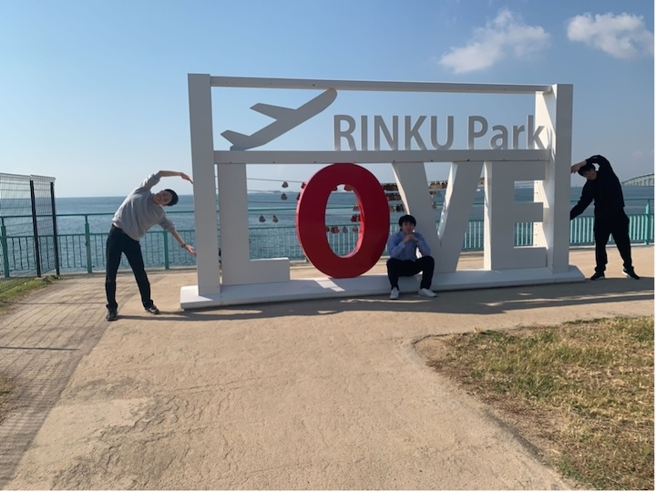

# スタディツアーに行って参りました！

高橋・狩川研究室の嶋貫です。
肌寒い季節となってきましたね、、
工事のため建物の暖房が使えないので高橋・狩川研究室にとっては厳しい冬になりそうです。ぜひ研究室にもこたつを導入してほしいですね！

さて話は1か月ほど遡りますが、私たち高橋・狩川研究室の代表者５名は10月末にスタディツアーとして大阪の安全にかかわる施設・企業に訪問させていただきました。

スタディツアーとは、技術社会システム専攻が毎年行っている研修で、生徒自身がどの施設に研修・見学するかを計画して実際に現地に訪問します。それぞれの研究室の研究テーマに合った研修を行うことができるため、毎年多くの学生が参加しています。私たちの研究室は「安全」を一つの大きいテーマとして研究を行っているので、現場での安全について学ぶことをテーマに安全に関わる施設・企業に訪問させていただきました。

## 訪問先１：航空保安大学

初日は航空保安大学校に見学させていただきました。
航空保安大学校は国土交通省が管理している航空管制官の育成施設で、航空管制官の方々はここでの8か月の研修期間を経て各空港の管制塔に配属、実地にて訓練を行います。

はじめに、施設内のターミナルレーダー管制業務やエンルート管制業務、管制塔の業務で用いられるシミュレータやそこでの研修内容について見学させていただき、その後こちらから研修内容や航空管制官の業務について詳しく質問させていただく時間をいただきました。
　普段聞くことができない管制業務のお話や、訓練でCRMを応用して取り入れていることなど様々なお話を聞かせていただきました。実際に管制官を経験している方々のお話を聞けて、有意義な時間でした。航空グループでは航空管制について研究している人も多いので、ぜひこの経験を生かしていただきたいです！

　
航空保安大の皆様、貴重なお時間をいただきありがとうございました！

# おわりに

スタディツアーの他の施設については長くなってしまうのでまた後日書かせていただきます！

これからより寒くなっていくので皆さん体調にはきをつけて下さい！

嶋貫
