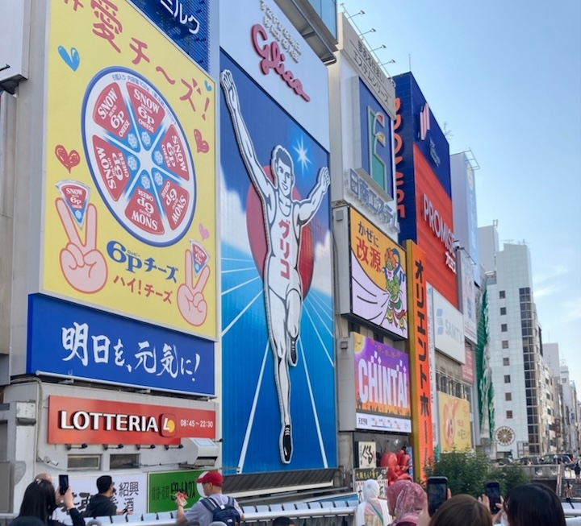

# まずはあいさつ

ブログ係の嶋貫です。M2とB4の皆さん論文発表お疲れ様でした！
時間が経つのは早いことで、まだスタディツアーのブログを書いている間に卒業式が近づいて驚いています。

**本当に遅筆ですみません！！！**

記憶がまだある間にスタディツアーのブログを書いてしまおうということで10月のスタディツアーの2日目の内容について書かせていただきます。

# スタディーツアー2日目

スタディツアーの二日目は、関西空港の安全を守る**関西エアポートオペレーションサービス株式会社**の点検や訓練内容の見学をさせていただきました。

## AFOC(エアフィールドオペレーションセンター)

まず初めにAFOC(エアフィールドオペレーションセンター)にお邪魔させていただき、普段の訓練・活動内容や空港内で活躍する特殊な消防車を見学しました。
関西空港は2018年9月4日、台風の影響により滑走路やターミナルが浸水、タンカーの衝突によって連絡橋も不通となり利用客が孤立しました。そのような被害を二度と繰り返さないために、現在は浸水対策の特別車両を多数導入して日々訓練を行っています。
　見学の際は、排水ポンプを用いた排水訓練の実演を行っていただきました。息の合った素早い対応を実際に見ることができ、空港の**安全意識の高さ**を再確認しました。

## NAOC(ノースエリアオペレーションセンター)

その後はNAOC(ノースエリアオペレーションセンター)に移動して、空港での火災に対応する特殊車両の見学、火災時の特殊車両のシミュレーション体験をさせていただきました。
シミュレーションは実際の運転席を詳細に再現しており、複数人による同時の訓練も可能で、実際の災害現場に非常に近い体験ができます。私たちも実際に体験させていただき、操縦や素早い消火の難しさを実感しました。
また屋外にて、航空機火災に対応する特殊車両の放水を実際に見学させていただきました。
最新技術による放水は高い水圧により迫力があり**圧巻**でした！

# おわりに

2日目は、関西空港での航空安全への取り組みや、日々の訓練について見学させていただきました。普段では見られない様々なものを体験・見学させていただき、非常に実りある実習でした。
関西エアポートオペレーションサービス株式会社の方々、**本当にありがとうございました！**

以下は関西での思い出の写真です！続きをお楽しみに！

###### #移動の合間に道頓堀にも行きました

###### #美味しいたこ焼き食べたよ

