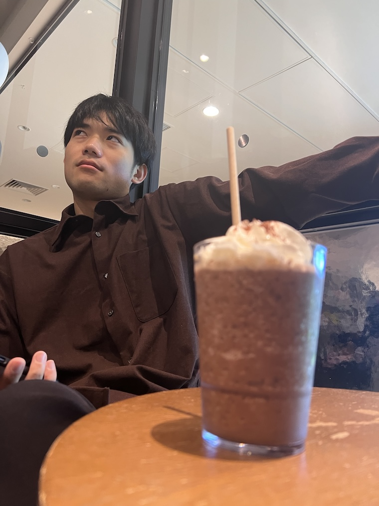
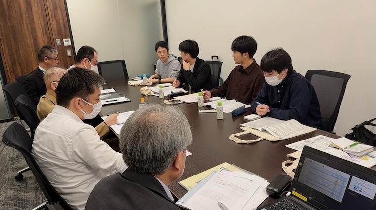
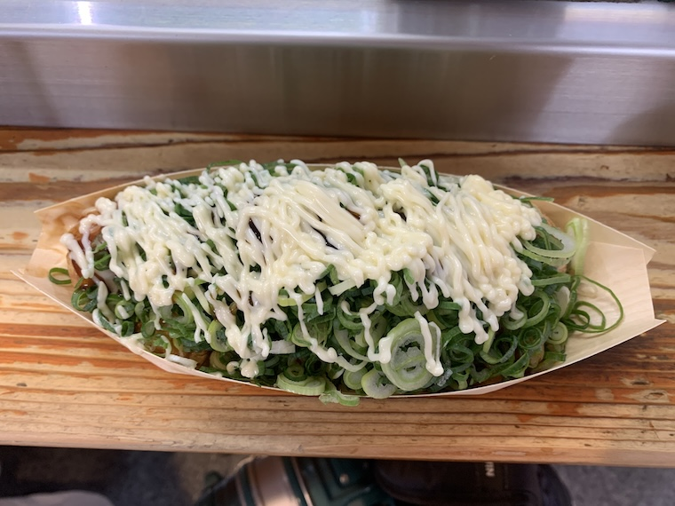

# スタディーツアー最終日！

ブログ係の嶋貫です！楽しかったスタディツアーも最終日です！

## 松屋で朝食

せっかく大阪で過ごす三日間なので、最終日の朝食はもちろんホテルから徒歩30秒の**松屋**です。
余裕を持ってホテルを出発したので、優雅に290円の朝定食をいただきます。~~こんな優雅な朝があってもいいのだろうか。~~

## 目指せ天王寺

最終日は、**JR西日本の安全研究所**で、研究所の方に研究所についての説明と研究に関する議論を行います。
優雅な朝食を終えて電車で向かいますが、梅田を出発したときにポケットを確認すると、

**「あれ、スマホがない…」**

頑張って記憶を遡りますが、何度遡っても最後に見たのは松屋の机の上。
他の4人は **「時間余裕あるし、スタバでコーヒーしばいとくわ」**
1人寂しく電車を降りて、松屋まで帰ることにしました。あいつら冷たいな。。

## 優雅にスターバックス

朝食を取ったお店にスマホを忘れるという凡ミスを犯してしまい取りに戻るというタイムロスがありましたが、無事に回収できました。
その後天王寺のスターバックスで合流してもなおまだ時間に余裕のあるスケジュール。なんて**完璧なタイムマネジメント！**

###### #一緒に優雅なスタバタイム

## いざ！安全研究所！

優雅な朝のコーヒータイムに別れを告げ、いざ安全研究所へ向かいます。
集合時間10分前に到着し、看守さんに要件を伝えると

**「本日そのような予定は入っていませんね」**

...おや？そんなはずはない。場所も時間も何度も確認したはずだ。
看守さんも再度確認してくれたが、やはり予定は入っていない。

急いで担当の方に連絡して確認すると、どうやら安全研究所は本社ビル[^1]へ移転していたようでした。
私たちが確認した資料が少し古かったようです。
また互いに大丈夫だろうと思っていたようで、具体的に場所についてはメールなどでの確認は行なっていませんでした。**人間の認知って難しい**と改めて痛感した出来事でした。
担当者には電話で謝り急いで天王寺[^2]を後にします。

## 今度こそ！いざ！安全研究所！

30分遅れてしまいましたが、安全研究所に無事到着。
JR西日本安全研究所の方々、ご心配とご迷惑をおかけしてしまい申し訳ございませんでした。

JR西日本安全研究所では、安全研究所の研究内容についての説明をしていただき、その後研究について質疑応答と意見交換会を行わせていただきました。
JR西日本で福知山線事故後の会社内の安全管理の仕組みや現場の作業内容の改善内容や現在取り組んでいる研究内容について説明していただき、非常に深い議論をすることができたと思います。
また研究している内容に互いに重なる部分が多く、今後の研究を進める上で非常に実りあるものとなったと感じています。
**JR西日本安全研究所の皆様ありがとうございました。**

###### #安全研究所での議論の様子

## 空港に向かう前に

空港についてしまえばもう私たちの大阪は終わりです。その前になんとしても可能な限り大阪を食べなければ！！
というわけで**はなだこ**を食べに行きました！

###### #1時間も並んだよ

ネギたっぷりで本体が見えないけど、並んだ甲斐があってとても美味しかったです🤤

## 3日連続3回目 関西国際空港

その後、3日間のカリキュラムが終わり、帰りの飛行機に乗るために空港へ向かいました。今までは電車で行っていましたが、最終日はバスで向かいます。
乗り換えなしで寝てるだけで空港に着くなんて…なんで今まで気づかなかったんだ！
ここまでブログを読んでくださった方は気づいたかもしれませんが、私たちは3日間の日程すべてで関西国際空港へ訪れています。
先方との調整の結果だから仕方ないものの、宿泊地の梅田と関空は片道1時間…なんとかならなかったのか…[^3]

研究室へのお土産も買って、3日連続の**マクド**[^4]も満喫して保安検査場を抜けるとなぜかめちゃ混み。
いやだなぁ…怖いなぁ…
トラブルって連続するものなんですね。悪天候による使用機材の未着によって2時間近く待ちました。
でもこの程度のトラブルにはもう慣れっこです。6便分の乗客が狭い第二ターミナルの制限区域に押し込められているので椅子や机などはもちろん空いていないので、みんなで床に座って大富豪タイム。
周りの皆さんも特に慌てる様子なく、各々の時間を過ごしていました。

予定では明るいうちに仙台に到着する予定でしたが、飛行機に乗った時にはすでに夜。今まで知らなかったのですが、ピーチでは離陸前と着陸前に客室内の照明を全点灯します。
保安上の理由とのことでしたが、多くの航空会社では逆ですよね…ANAはどうしてるんだっけ。

ちなみに帰りの飛行機は5人で窓際縦5列を予約しました。**結局みんな窓の外が見たい！**

# おわりに

最後までほんとトラブル続きでしたが、多くのことを学び、美味しいものをたくさん食べ、思い出が多く残る3日間でした。
　技術社会システム専攻に入ればこのように自分達で計画を立てて研修を行えます！
もし読んでいる方に大学院に進学をしたい人がいたら、
[技術社会システム専攻](https://www.takahashi.qse.tohoku.ac.jp/blogs/info/how_to_join/index.html)、おすすめです。

[^1]: 宿泊していたホテルから徒歩15分

[^2]: 終わったら飛行機の時間まで天王寺動物園に行こうとしてたことは内緒🤫

[^3]: なんとかなりませんでした。すみません(アポ担当)

[^4]: マックじゃないのがポイント
