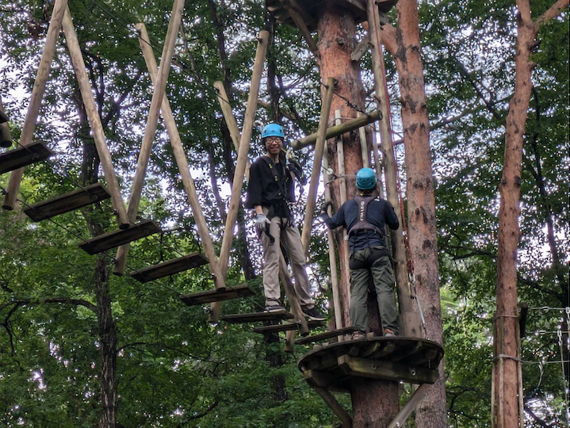
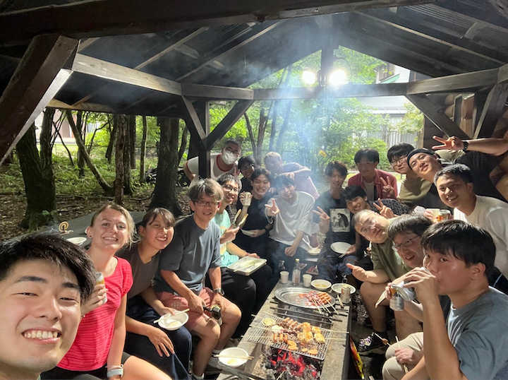
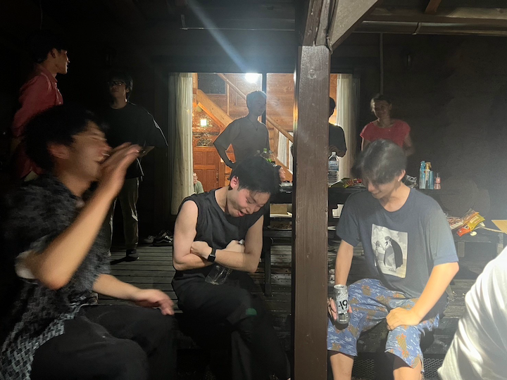
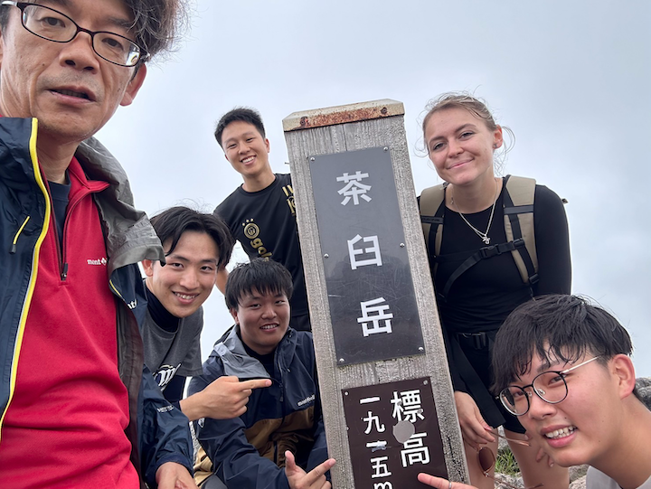
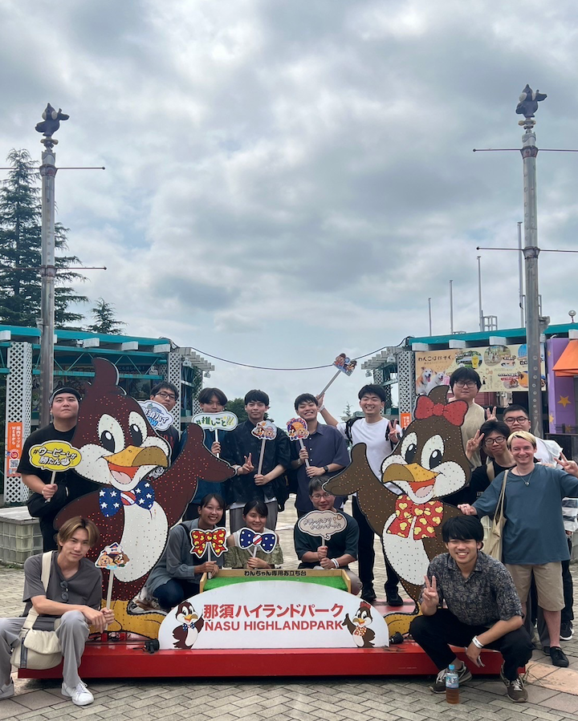
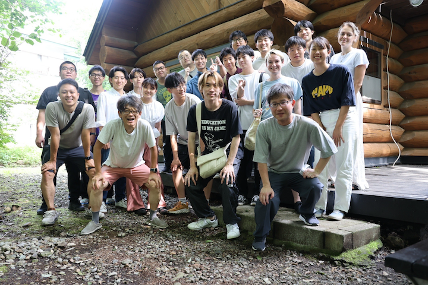
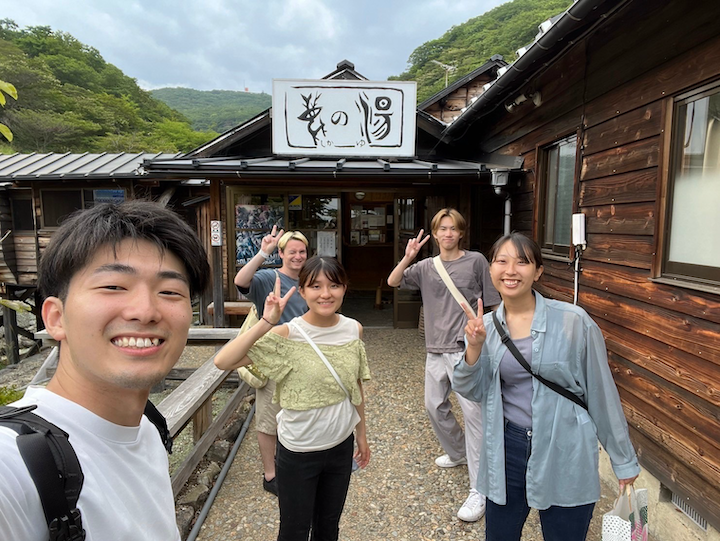
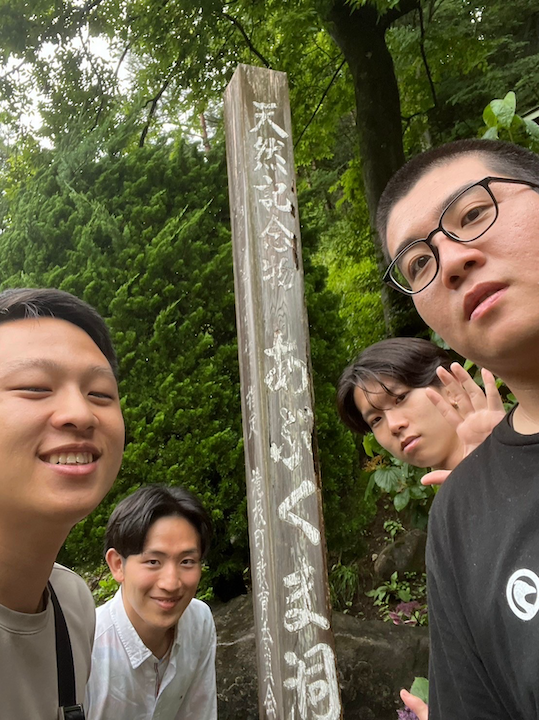

私たちの研究室では毎年B4が企画・プレゼンを行い、3日間の『夏の学校』を実施しています。
那須高原での3日間は、天候にも負けず、全員が心を一つにして楽しみ尽くしました！チームの挑戦精神と笑顔が溢れるこの旅の様子をお届けします。

# 1日目：仙台から那須へ、嵐の中の挑戦

**Day 1: Depart from Sendai to Nasu**

## 那須の森の空中アスレチック NOZARU

The weather on the first day was bad, with thunderstorms from noon to night, but everyone still bravely challenged NOZARU (an outdoor climbing sport).

初日はあいにくの雷雨。しかし、それでも皆の挑戦心は止まりません！午前中のうちに仙台を出発し、雷鳴が轟く中、アウトドアのクライミングスポーツ「[那須の森の空中アスレチック NOZARU](https://nozaru.net/nozaru/index.html)」に挑戦しました。

Machida, Imai, Takezaki, and Suzuki succeeded in the challenge! **Cheers to the warriors!**

勇敢にも挑戦を成功させたのは、町田さん、今井さん、竹崎さん、鈴木さんの4名！**この日一番のヒーローたちに拍手を！⛰️⚡️**

###### これから挑戦する人たち

###### 余裕の表情のWarrior

## 夜はバーベキュー

In the evening, everyone gathered to enjoy delicious Chinese barbecue and beer, everyone had a lot of fun. The professor also prepared delicious curry rice and yakisoba for the late B3 students, and everyone had fun until midnight. Thanks to the professor and students who prepared the food!

夜には美味しい中華バーベキューと冷たいビールで大盛り上がり。先生は遅れて参加したB3のために特製カレーライスと焼きそばを振る舞ってくれました🍛🍻。おかげで深夜まで大盛り上がり！料理を用意してくれた先生と学生たちに感謝です！

###### BBGの様子

###### 爆笑

# 2日目：自由行動！山登りチームとハイランドチーム

**Day 2: Separate actions, mountain climbing and HIGHLAND**

2日目はそれぞれ自由行動に分かれ、山登りチームとハイランドチームが大自然を満喫しました！

## Climbing Team 登山組

The mountain climbing team led by Professor Takahashi successfully conquered Chausu-mountain, which is 1,915 meters above sea level! **Very beautiful scenery!**

山登りチームは、高橋教授のリーダーシップのもと、**標高1,915mの茶臼岳に無事登頂！**澄み切った空気と絶景に感動し、疲れも吹き飛びました🏔️。

###### 山頂でパシャリ📸

## HIGHLAND Team 那須ハイランドパーク組

Everyone in HIGHLAND also had a lot of fun, experiencing the exciting roller coaster and the terrifying haunted house!

一方のハイランドチームは、那須ハイランドパークで絶叫マシンに挑戦！特にローラーコースターとお化け屋敷は大好評。怖いもの知らずのメンバーたち、スリルを満喫しました🎢👻。

###### ウーピーしか勝たん

# 3日目：那須から仙台へ、それぞれの帰路

**Day 3: Depart from Nasu and return to Sendai**

Everyone followed different routes on the way back to Sendai, and also enjoyed different scenery along the way!

最終日、皆はそれぞれ異なるルートで仙台へと戻りました。途中、各自が見つけた素晴らしい景色やお土産話を持ち帰り、それぞれの思い出が心に刻まれたことでしょう。

###### 最後に貸切ロッジでパシャリ📸

###### 温泉組

###### こっち見んな

Finally, thanks to this training, everyone was able to experience the beauty of Nasu and enjoy being a member of this big laboratory family!

この合宿を通して、私たちは那須の自然の美しさを堪能し、ラボの仲間との絆をさらに深めることができました。全員がそれぞれの挑戦を楽しみ、学び、そして成長した素晴らしい3日間でした。また次回の冒険が楽しみですね！皆さん、本当にお疲れ様でした！
