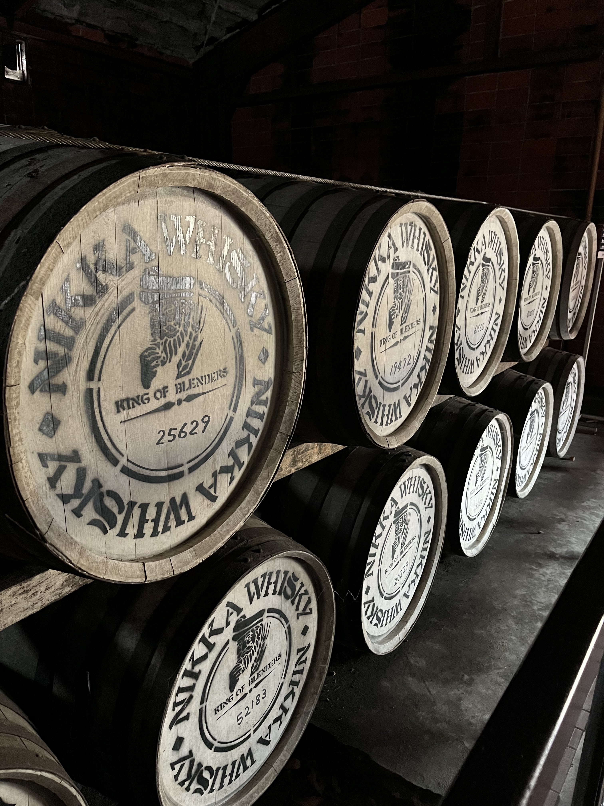
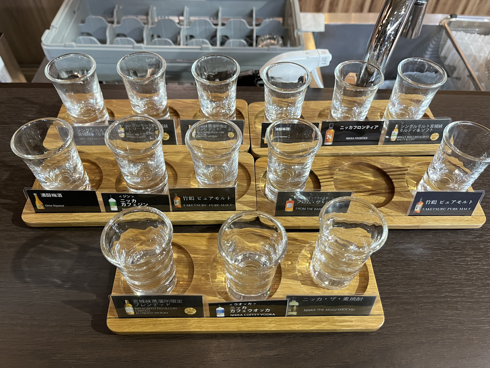
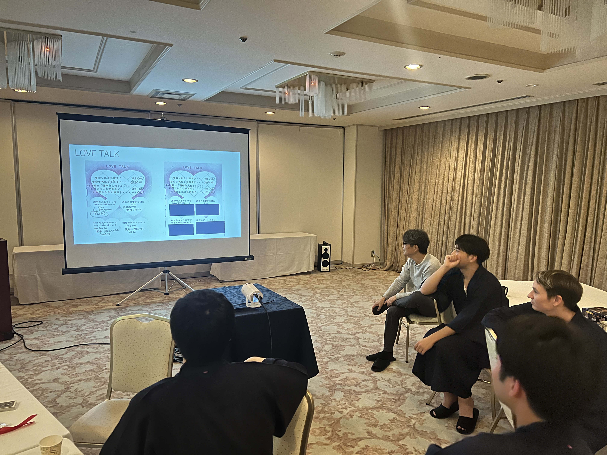

# あいさつ
皆様あけましておめでとうございます！
12月のブログ係の竹内です。すっかり年末年始でブログ係を忘れていましたが、12月末に行われた忘年会について書いていきたいと思います！
1年間お疲れ様でした！

# 忘年会
毎年恒例の忘年会を行いました。私たちの研究室では毎年B4を中心に1泊2日で忘年会を行なっています。今年も昨年と同じメルキュール宮城蔵王スパ&リゾートさんにお世話になり、たくさんの美味しいご飯とお酒をいただきました！
平日に行われたため、各自授業や研究が終わり次第、会場となる蔵王へ向かいました。
忘年をするべく張り切って午前中からニッカウィスキー宮城峡工場へ見学に行ったチームもありました。

## ニッカウィスキーチーム
ウィスキー工場の見学では、ウィスキーの製法の解説や、各工程が実際に行われている施設を見せていただき、最後にお目当てのウィスキー試飲ができました。

ウィスキー好きのこのチームは、無料でできる試飲3種類に加えて、製造方法が異なるウィスキーなどをさらに課金して10種類程度嗜んでいました。その後、偶然見つけた旧川崎小学校の校舎を利用したピザ屋さんで美味しい蔵王ピザをいただきました。偶然見つけたのに非常に美味しくて大満足でした。

## ホテル到着〜１次会
続々とホテルに到着すると、まずウェルカムドリンクでシャンパンやビール、そのほかたくさんのドリンクをいただきました。
おつまみやお菓子も用意され、もてなされた後はホテルの豪華な温泉に入り、癒されました。
夕食の一次会では、ビュッフェ形式の豪華なご飯がたくさん用意され、またドリンクの種類もアルコールからソフトドリンクまで幅広く、満腹まで楽しみました。
この時点でみなさん結構アルコール入ってます笑

## ２次会
夕食後は二次会として大広間が用意され、B4プレゼンツの企画を行いました。
今年の企画は
 **毎年恒例のプレゼント交換会！**
 **平成の文化である研究室のプロフィール帳**
の２本立てです！

### プレゼント交換会
プレゼント交換会では、毎年その年にちなんだテーマを決めて、それを元に各個人で買ってきたプレゼントをプレゼントし合います。今年のテーマは「頂き女子りりちゃん」でした笑
今年のテーマは非常に難易度が高かったです。多くの人が頭を抱えていましたが、「頂き女子りりちゃん」が好きだったというちいかわグッズや、お金にまつわる便利グッズ、”Top”の意味で「頂き」にかけて山の頂上にいるキャラクターが印刷されたTシャツなどがプレゼントされました。
その中で最もテーマに沿っているという賞に選ばれたのは、狩川准教授がプレゼントされた、瀬戸内寂聴さんの著書で「騙されないようにするためにはやはり年上の女性から教えを乞うのがいいですよね」というお言葉でした。

### 高橋・狩川研プロフィール帳
平成の文化プロフィール帳では、研究室メンバーに事前に書いていただいたプロフィール帳からおもしろ回答や珍回答を選出し、クイズ形式で発表を楽しみました。
中でも研究室内から結婚が早そうな人や、お金持ちになりそうな人を選んでランキング形式で発表したものは大盛りでした！

> [!CUSTOM] orange paper_airplane B4より
> 楽しんでいただけて良かったです

# おわりに
皆様昨年は大変お世話になりました。
今年もしっかり研究をしつつ、よく飲み、よく食べ、研究室生活を楽しんでいきたいと思います！
何卒よろしくお願いいたします！

