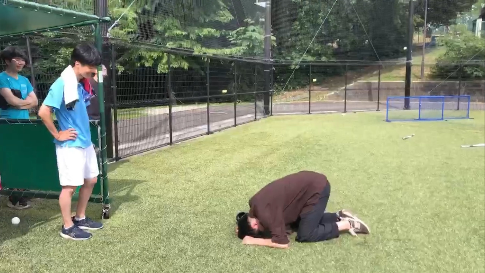
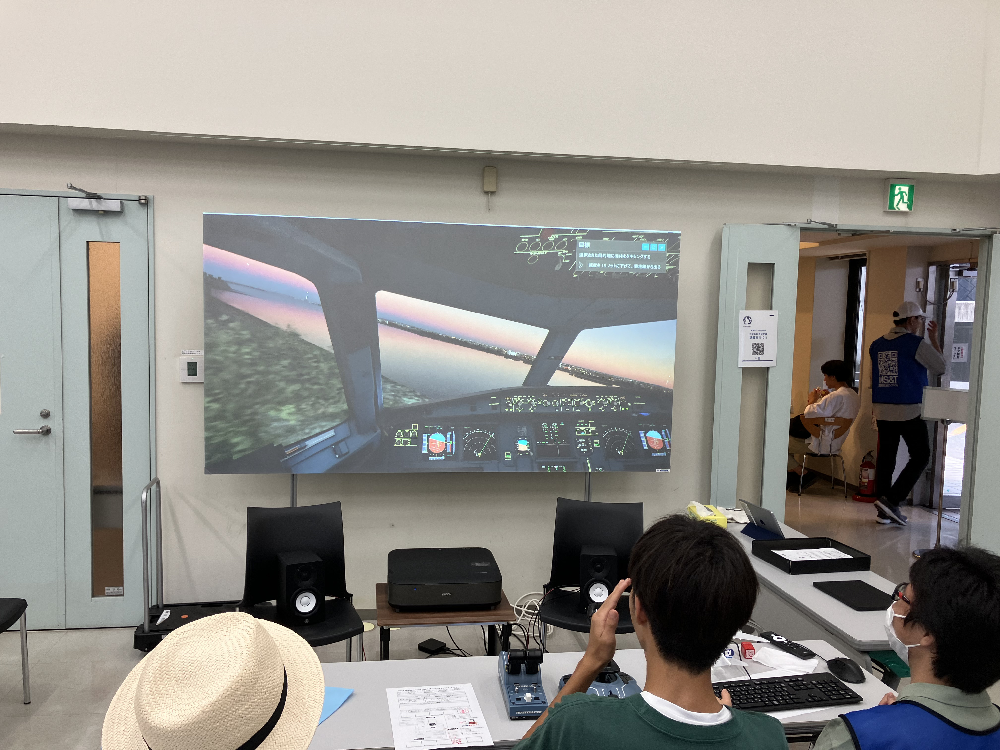
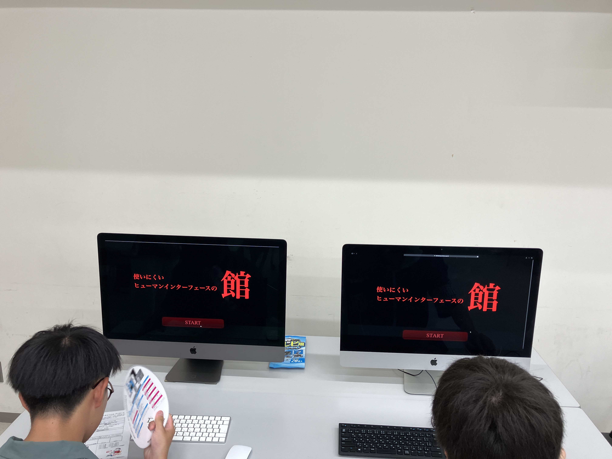

こんにちは。7月ブログ担当のM1の大三川です。

東北地方に住んで1年目なのですが梅雨明けの遅さに驚いています。
気象庁によると東北南部の梅雨入りは6月23日頃で梅雨明けは8月1日頃だそうです。
梅雨は6月のイメージでしたが7月がずっと梅雨だったようです。

さて、そんな梅雨の真っ盛りだった7月のブログは
・B3の紹介
・ソフトボールの試合
・オープンキャンパス
3本立てでお送りします。

# B3の紹介

5月末より学部3年生3名が研究室に配属されたので、自己紹介を一言頂戴しました。

## 国仲佳瑞

新しく配属されました、B3の国仲佳瑞（くになかよしみず）です。大の旅行中毒者で、原付や船などを使ってふらっとどこでも行きます！よろしくお願いします。

## 酒井藍

最近部活を引退したばかりなので、これから好きなことを見つけて頑張りたいです！よろしくお願いします

## 佐々木隆之介

大阪から来ました。
ブルーグラス同好会とボディビル部に所属しています。
ミスチルが好きです。ラーメン二郎が主食で、週1は絶対に食べます。

> [!CUSTOM] green report 筆者のひとこと
> 非常に個性的な面々です。はい。かなり個性的です。

# ソフトボールの練習試合

7月2日に灼熱の青葉山グラウンドで某研究室と研究室対抗でソフトボールの試合を行いました。

我が研究室は残念ながら敗北という形で試合は幕を下ろしました。延長を嶋貫キャプテンの土下座の末に受け入れてもらい、さらにこちらに有利な形で延長の延長まで受け入れてもらましたが負けました。

元高校球児の炎上、ただの内野ゴロで捻挫しかける等のアクシデントはありましたが非常に楽しかったです。

なお、3番遊撃手として獅子奮迅の活躍を見せた中島君は「課題は打撃」と述べておりました。リベンジに燃えています。

## #キャプテンの土下座

> [!NOTE]
> 筆者も参加しており、４番を務めました。
> 3番の中島君が作ったチャンスをことごとく潰しました。

# オープンキャンパス

7月30日、31日にオープンキャンパスが開催されました。
本研究室も **「コックピットの進化を体感する ～フライトシミュレータ体験～」** と **「最恐！使いにくいインターフェイスの館」** という毎年恒例の2つの体験型の展示を行いました。

中にはホームページを見て高橋・狩川研究室に興味を持って訪れてくれた方もいました！ありがとうございます！

フライトシュミレータ体験では、石鍋先生のご厚意で **100インチのディスプレイ** をお借りしました！石鍋先生ありがとうございました！
技術社会システム専攻としては毎年恒例の豪華？景品が当たるスタンプラリーを行い、たくさんのアイスが冷凍庫に眠っていました。(写真は2日目なのでだいぶ減っています)

## #フライトシミュレータ

## #使いにくいインターフェースの館

## #大量のアイス

まだまだ暑い日が続きますが、熱中症に気をつけて夏を楽しみましょう！
それでは次のブログでお会いしましょう！
