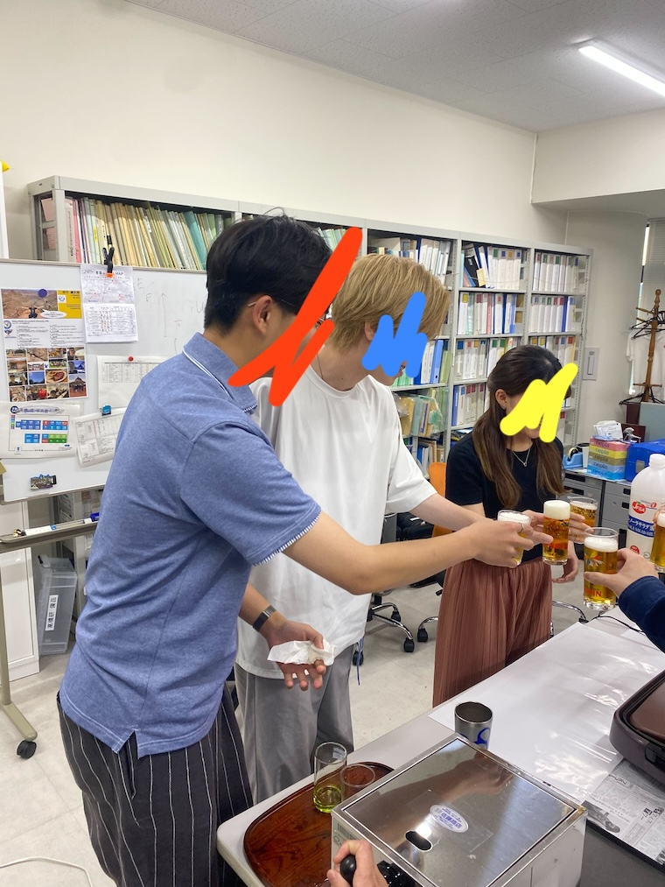
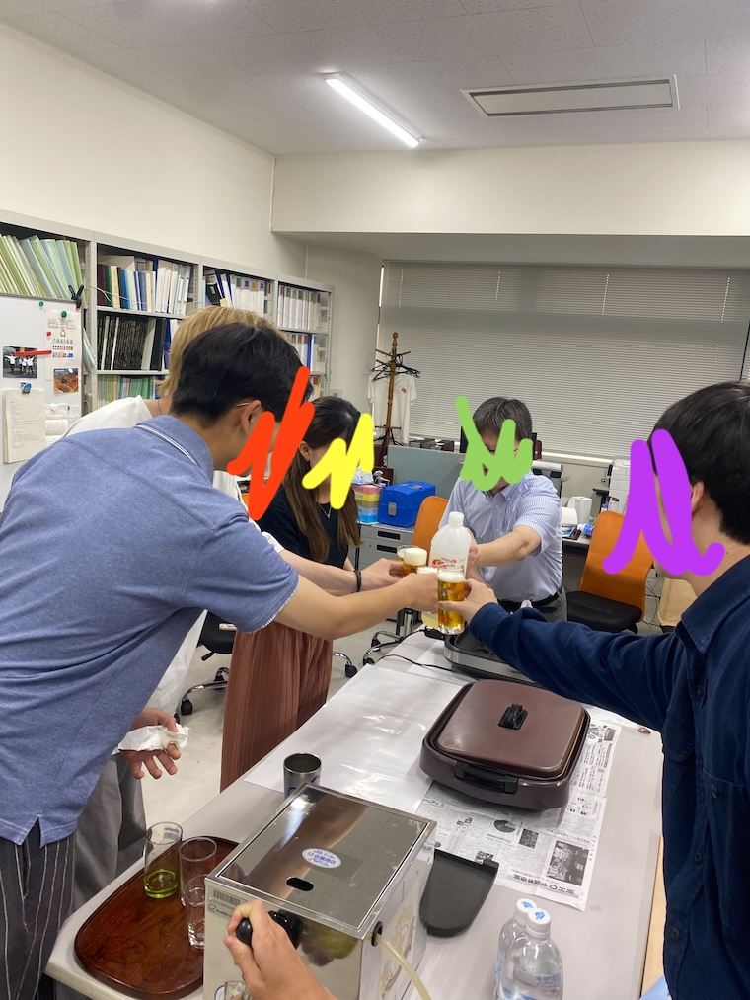
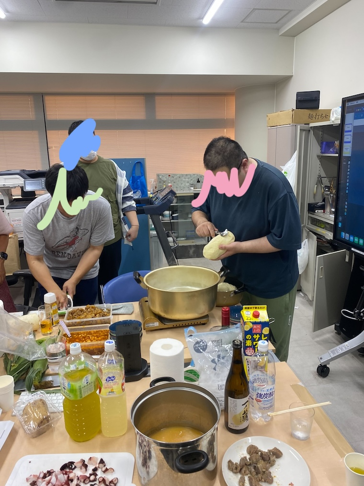
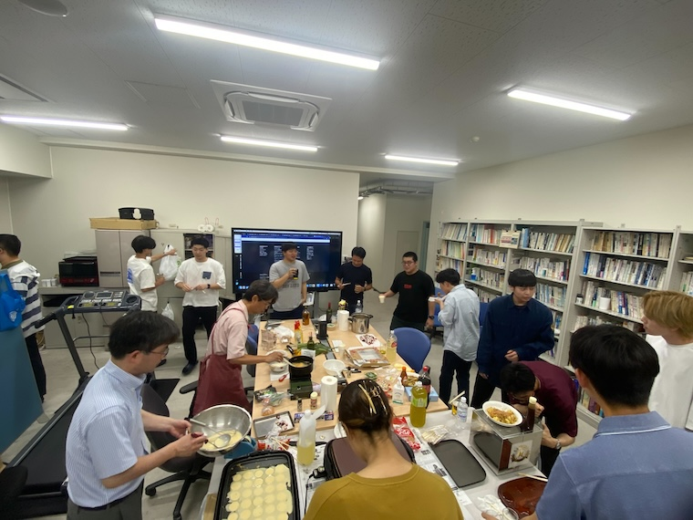

6月も終わりに差し掛かり、ようやく梅雨の気配が感じられるようになりました。今年は梅雨入り前にもかかわらず、30度近い気温の日もあり、夏の到来を予感させる6月でした。急に暑くなると体調を崩しやすくなるので、皆さんも体調管理には気を付けてくださいね。

今回は、高橋狩川研究室の6月の様子をご紹介します。特に、6月18日に行われたB3の歓迎会についてお話しします。今年度は新しくB3が3名加わり、研究室のメンバーが増えました。歓迎会は毎年恒例のイベントで、新しいメンバーと既存のメンバーが親睦を深める重要な機会です。

# 刀削麺で盛り上がる歓迎会

今年の歓迎会では、毎度おなじみのビールサーバーに加えて、今回はなんと刀削麺(ダオシャオメン)が振る舞われました。刀削麺は中国の伝統的な麺料理で、中国からの留学生を中心に製麺から行われました。私も初めて食べましたが、麺の形が均等でない分、もちっとした部分やコシの強い部分があり、この独特の食感にやみつきになりました。

###### #ビールを注がれるB3

###### #B3と乾杯する先生とM2

###### #刀削麺作る人

###### #歓迎会の様子

# 多様性に富んだ新メンバー

歓迎会では、新しいB3のメンバーたちが自己紹介を行いました。新メンバーたちはそれぞれ異なるバックグラウンドを持っており、より多様性に富んだ研究室になることが期待されます。このようなイベントを通じて、研究室全体の結束力が高まることを感じました。

# 夏本番、ソフトボール対決へ

そして、7月からはいよいよ夏本番。噂によると、某研究室とのソフトボール対決が計画されているとか、いないとか。暑い中での試合となるため、熱中症に気をつけながら、目一杯楽しみたいと思います。

<!-- [!CUSTOM] [色] [アイコン] [タイトル] -->

> [!CUSTOM] emerald trophy
> 試合の様子は次のブログで詳しくお伝えしますので、ぜひご期待ください。

皆様もお体に気をつけて、健康にお過ごしください。暑さに負けず、素敵な夏をお過ごしくださいね。それでは、また次回のブログでお会いしましょう！
