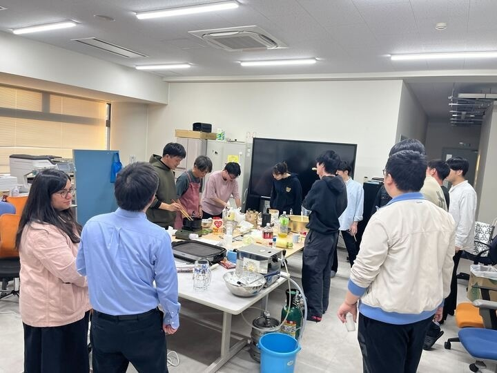
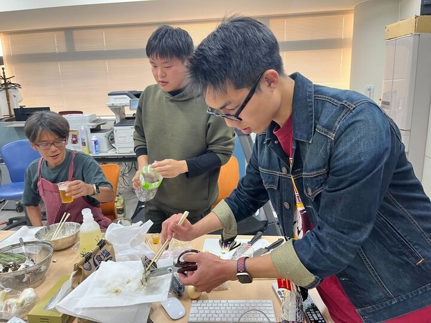

# ５月

今年の春から高橋狩川研究室の所属になりました、修士１年の鈴木海晴です。
満開だった桜が散り、気づいたら夏の暑さの片鱗を感じるような季節になってきましたね。
春から新しく始まった仙台の生活にも慣れ、私は５月病にならずに充実した日々を送っています。

## 中間発表

5月10日、技術システム工学専攻の修士課程2年生が中間論文発表を行いました。
私は発表者ではなかったのですが、発表は無事に終わったそうです。
次の中間発表は12月にあり、私たち終始1年生も発表することになります。
良い発表ができるように、今からコツコツ準備していきます。

> [!CUSTOM] cyan thumbsup 先輩方へ
> 大変、お疲れ様でした！

## 歓迎会

5月22日に研究室の新メンバー歓迎会が開かれました。
新しく研究室に来た私たちは、ようやく歓迎されてほっと一息。
さらに、ミシガン大学の助教授であり原子力のプロフェッショナルのアディティさん（Aditi Verma）を招待しました！
**Thank you for coming！**
料理は、学生が手伝いながら、料理が得意な高橋先生に振る舞っていただきました。
非常に美味しい料理とお酒を飲みながら、親睦を深めることができました！

###### 歓迎会の様子

###### 天ぷら鋏で切ってるやつ

## 最後に

読んでいただきありがとうございました。
この研究室に来て約２か月が過ぎましたが、活気のある研究室で、先輩方も優しく、非常に楽しく過ごしています！
また、新しく研究室に配属になる学部３年生が決まりました！
...今度紹介します。（次以降のブログ担当の人が、おそらく ）
それでは〜。
