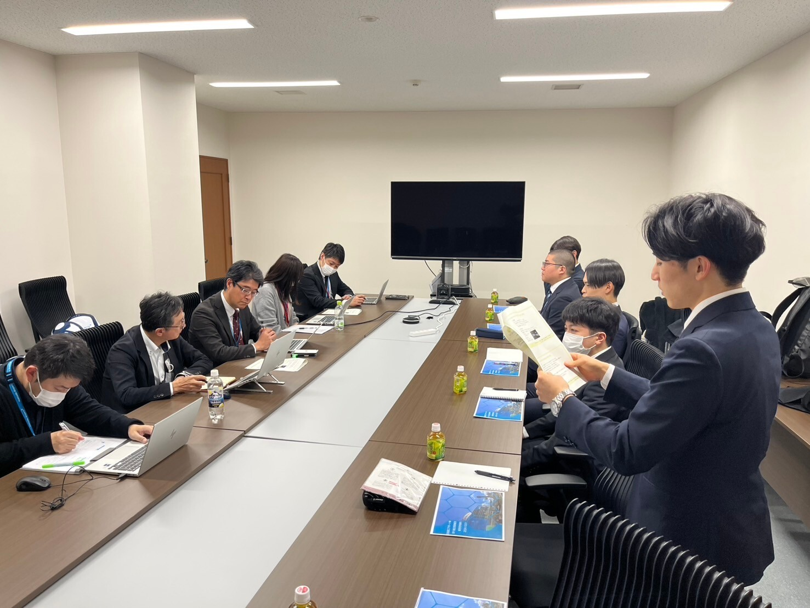
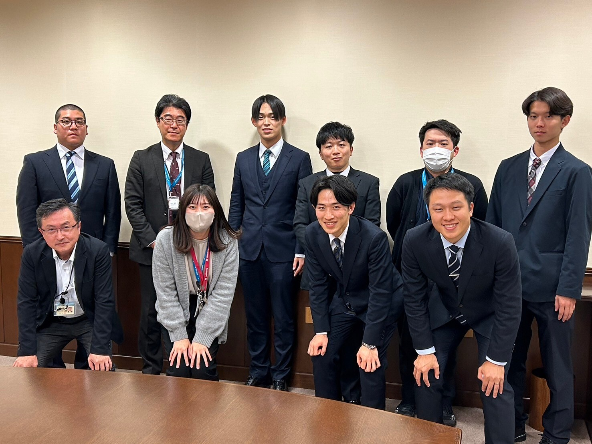
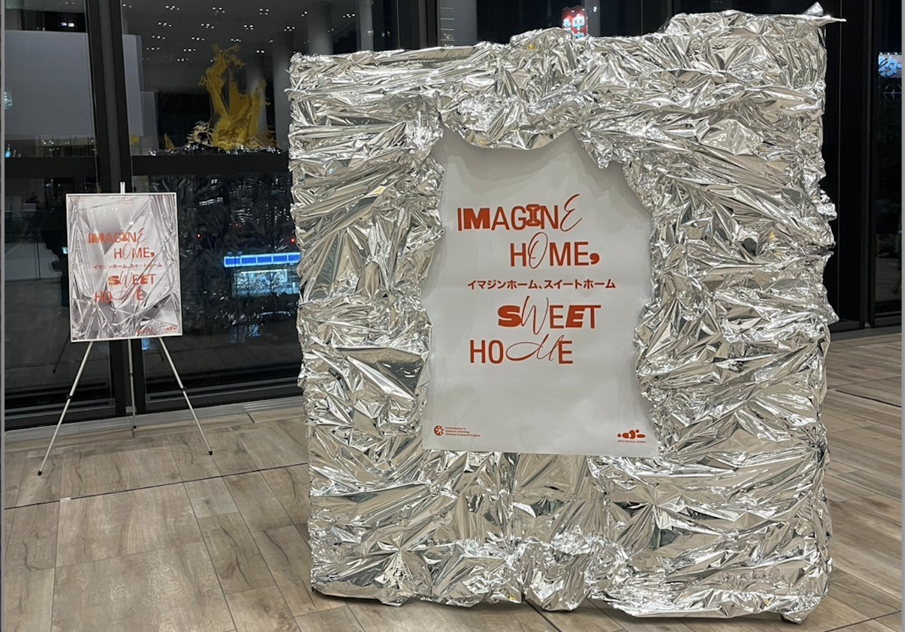
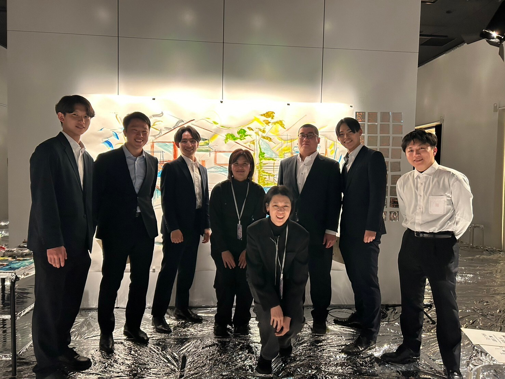

高橋・狩川研究室M1の鈴木です。 
2025年になりました。
  今年は巳年ということで、一皮剥けた成長をしていこうと思っています！

  技術社会システム専攻では、毎年M1が計画・調整をすべて行う企業研修「スタディツアー」を実施しています。
  今年は **北の大地「北海道」** を舞台に、さまざまな企業や施設での研修を通じて多くを学ぶ機会を得ました。
  また、北海道の文化についても理解を深める良い機会でした。
  特に食文化は最高でした。

  研修先は以下の通りです。
1日目：北海道エアポート、北海道大学CoSTEP
2日目：北海道電力、JR北海道
3日目：北海道博物館、北海道開拓の村
***
# 1日目「充実した企業研修の始まり」
## 研修1：北海道エアポート
  1つ目の訪問先は、道内7空港の運営・管理を行っている **北海道エアポート** です。
  実際に消防設備やエプロンでの荷物の運搬作業を見学させていただきました。
  その後のディスカッションでは、安全を含めた業務に関する様々な取り組みについて知ることができました。

  特に、観光客の受け入れ体制や地元産業との連携を強化し、北海道全体の発展に貢献している企業の姿勢に感銘を受けました。
  また、空港施設の維持管理や災害時の対応策など、運営の裏側にある課題についても詳しく伺いました。
  冬季の厳しい気象条件下での空港運営の工夫は、北海道ならではの特徴的な取り組みだと感じました。
  さらに、空港で働く多様な職種の方々の仕事内容や、最新技術を活用した効率化の事例も紹介していただきました。インフラ運営における「技術」と「人」の重要性を改めて感じる機会となりました。
> [!CUSTOM] lime thumbsup お礼
> お忙しい中研修させていただき、ありがとうございました。

## 研修2：北海道大学CoSTEP
  午後は北海道大学の **CoSTEP** （科学技術コミュニケーション教育研究プログラム）を訪問しました。
  CoSTEPは、科学技術と社会をつなぐコミュニケーションのあり方を探求し、実践する組織です。この訪問では、イベント「IMAGINE HOME, SWEET HOME」に参加する機会をいただきました。

  このイベントでは、朝鮮半島における「流通」と「分断」をテーマに、生成AIと人間が言葉とイメージの相互変換を行う様子を観察しました。
  大学生や社会人（20代〜50代の30名程度）が参加しており、アートと科学技術を融合したアプローチが印象的でした。
  特に、表現の共通点や違いを探る過程で、多様な視点を共有することの重要性を感じました。
  そして、異なるバックグラウンドを持つ人々と交流することで、普段では得られない視点から技術について考える良い機会となりました。
  この経験を通じて、科学技術と社会の関わり方についてさらに深く考えることができ、日常的な言葉で伝える力の重要性を改めて実感しました。
> [!CUSTOM] lime thumbsup お礼
> 斬新なコミュニケーションの体験ができました。参加させていただきありがとうございました。

***
## 〆のラーメン
  1日目の研修を終え、現場の仕事に対する熱意や工夫、コミュニケーションの仕方を柔軟に考慮することなど多くの学びがありました。
  この日の夕食は、CoSTEPのスタッフさんに教えてもらった **ラーメン店「けやき」** で、札幌ラーメンを堪能しました。
  仲間たちと研修の内容を振り返る暇もなく、熱く濃厚なラーメンを啜りました。
  明日への英気を養いました。
 美味しかったです。

  2日目もさらに深い学びと新たな発見が待っています。
  次回のブログでお伝えしますので、どうぞお楽しみに！

