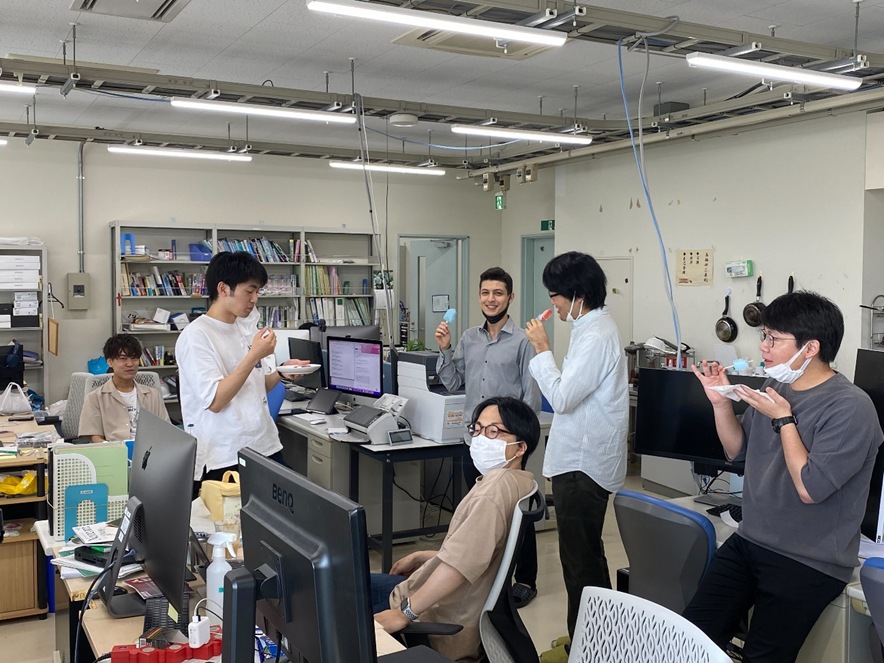

こんにちは！研究室ブログ、６月担当のM2髙橋です！

最近、やっと夏っぽくなってきました！！次は早く梅雨が明けるとよいですね！

そんなことはないと思いますが、ブログの更新日時が８月になっているとしたらブログ係の嶋貫君が更新を忘れていただけです。本当です。決して僕が書き忘れていたわけではありません。まったく彼は本当に怠惰ですね、しっかりしてほしいものです。

ということで、今回のブログでは高橋研の何気ない日常をお届けしようと思います。
その写真がこちらです。

M1本田君（一番左）、B4大槻君（左から二番目）、M1アミンさん（真ん中奥）、M1佐藤君（真ん中手前）、M1木村君（右から二番目）、M1原武君（一番右）です。

高橋先生が買ってきてくださったアイスを頬張っています。高橋先生、ありがとうございました！このように高橋研では、たまに先生方が差し入れを買ってきてくださります。また、高橋先生がおいしいごはんを作ってくださることもあります。ありがたいですね！

こんな感じで、毎日楽しく研究室で過ごしております！
次回の担当は、D3野々山さんです！お楽しみに！
