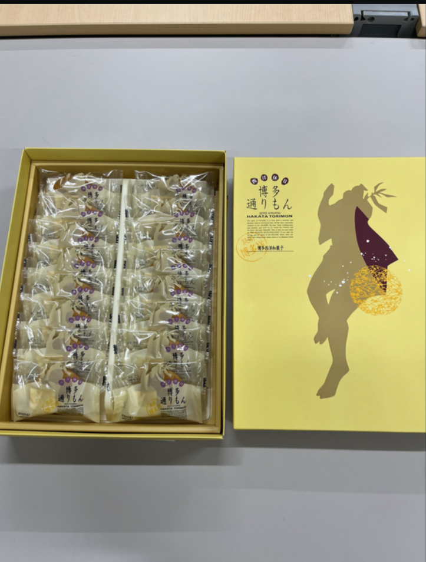
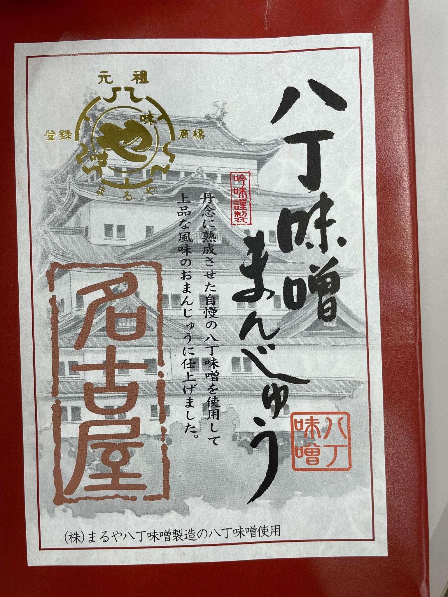
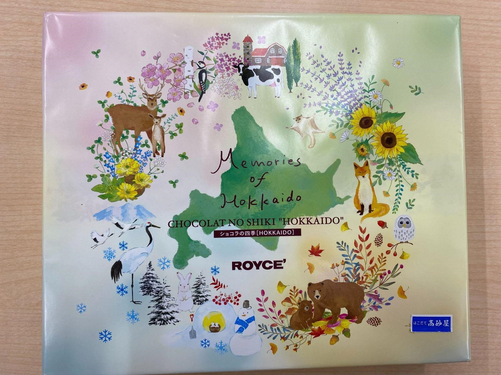
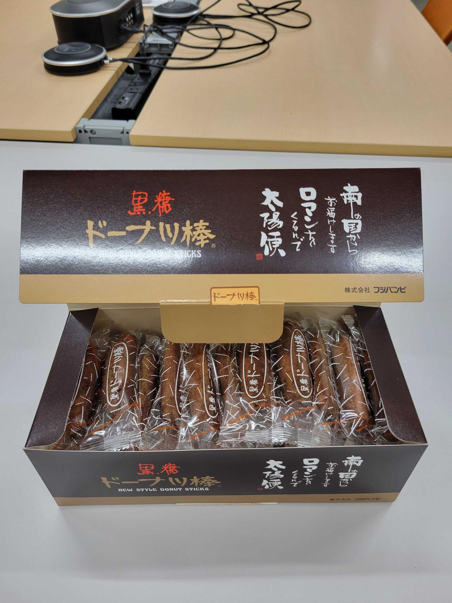

おはようございます

高橋・狩川研究室の日常をつたえるブログ、8月担当のしいのです。
アチアチの日々ですが無事に過ごしてますか？
私はなんだか最近電気代が高いのが怖いです。
たかはしケンの8月は基本的にはお休みです。
週１のミーティングがないためそれぞれで研究を進めたり帰省をしたりインターンに参加したり旅行をしたりしていました。
研究室のおやつがもっとも充実する月こと8月。
みんなのお土産がおいしかったです(_^^_)

ごちそうさまでした(_^^_)

【研修II】

あんまり書くことのない8月ですが、ひとつ始動したモノがあります。
それは学部3年生の授業のひとつ、研修IIです。
研究内容に関係する英語の論文を読んで、スライドにまとめて発表してみよう！という授業で、これは結構なかなか多分やはり大変ですね。
11月の発表に向けて、計画的に進めたいところ…
3年生のみんな、ファイトです。
学部1、2年生のみんなは今のうちに遊んでおいてください。

【クイズ】

なんの因果か8月のブログを10月に書いています。なぜでしょう。
P.S.太一ごめんね

＊＊＊＊＊＊＊＊＊＊＊＊＊＊＊＊＊＊＊＊＊＊＊＊＊＊＊＊＊＊＊＊＊＊＊＊＊＊

それでは皆様、高すぎる電気代にも止まらない食欲にも負けずに生きていきましょうね。
いつか会えるのを楽しみにしています。

しいの
