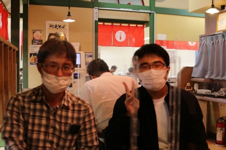
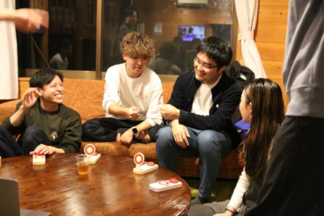
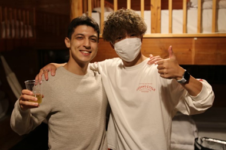
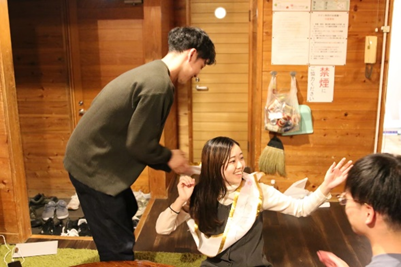
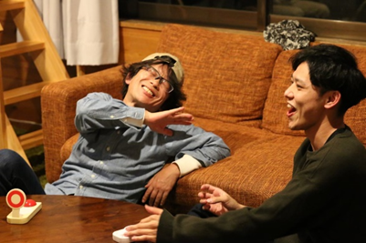
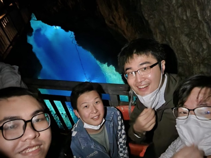
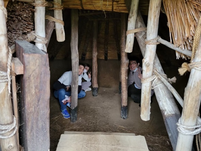
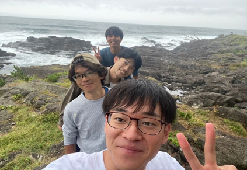
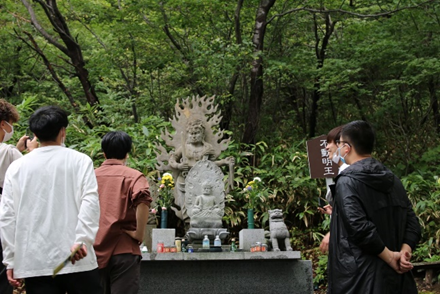

こんにちわ

9月担当になりました高橋・狩川研究室ブログ編集係の嶋貫です。

ブログ係の名に恥じないよう、素晴らしい高橋狩川研究室の魅力を伝えていきたいと思います。

9月のビックイベントとしては。。。

夏の学校in 青森

コロナになるまでは毎年行われていましたが、今年は約３年ぶりに開催されました。

二泊三日で青森に宿泊し、六ケ所村や恐山、山内丸山遺跡などを回って、観光勉強するイベントです。

初日は、八食センターにておいしいグルメを食べながら夕飯の材料を買い。

夜は先輩が準備してくれたクイズ大会で盛り上がりました！

二日目は何班かにわかれてそれぞれ観光を回り、夜は高橋先生行きつけの食堂のオードブル！

ついうっかり大事なお金の入った封筒を仙台に忘れたり（これは仕方ない）、九州男児が頑張りすぎたりとアクシデントも多かったですがとても楽しい夏の学校でした。

来年は企画・運営頑張って３年生！

僕は今年頑張ったので来年は楽します！

これから研究が忙しくなっていきますが、体に気を付けて冬を乗り越えましょう！
