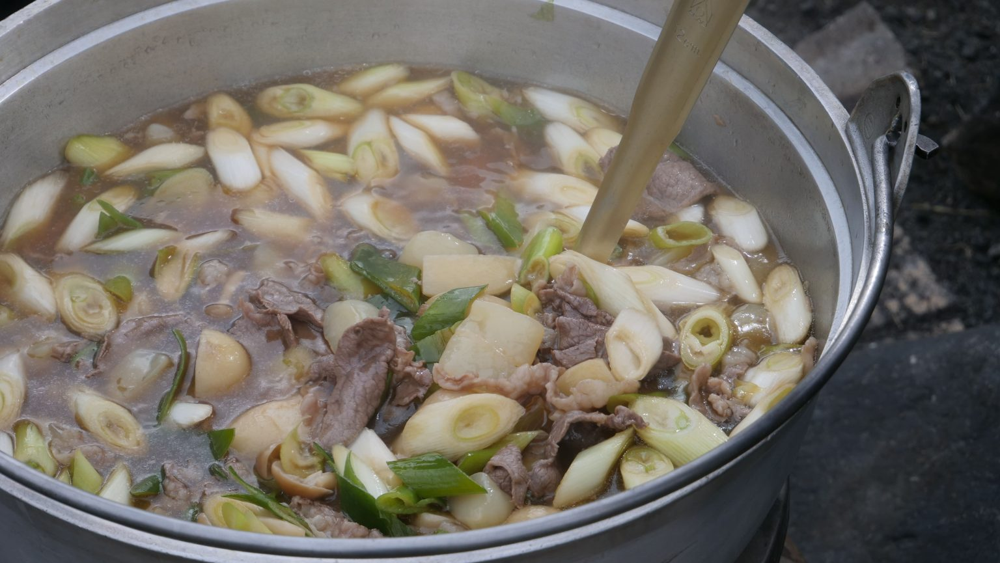
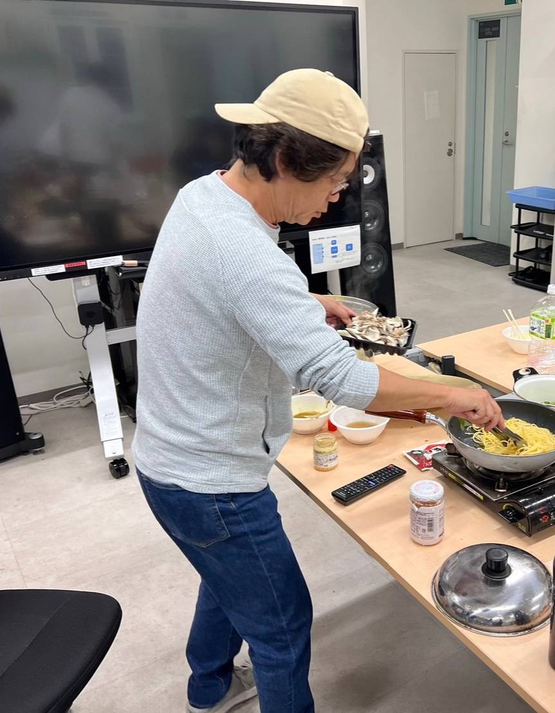

こんにちは。

10月のブログ担当のM1原武です。

（大変遅くなり申し訳ございません…、とうの昔ですがご容赦下さい…。）

さて秋も深まり、夜寒を覚える季節となってきた10月。

世間では食欲の秋や読書の秋などなど楽しいこと満載ですが、今月の高橋・狩川研はなんといってもイベントがない…！

ということで少し反則気味ですが11月に入り込みまして、11/3に開催された「芋煮会」をご紹介します！

東北には「芋煮会」という風習があります。

里芋などを用いた鍋を作って、みんなで食べつつ親交を深めるといったイベントです。

日本一大きな鍋で行う山形の芋煮会フェスティバルが有名ですね！

山形では醤油ベースに牛肉を用いたもの、宮城では味噌ベースに豚肉を用いたものがよく食べられています。

本学の部活やサークルでは広瀬川の河川敷でやるところが多いとか。

当研究室ではなんと高橋先生お手製の芋煮に舌鼓を打つことができます！

普段からよく料理を振る舞って頂いていますが、芋煮会では特に気合を入れていらっしゃったように見えました。

やはり東北人の血が騒ぐのでしょうか？？

私は今年東北にやってきたため初めての芋煮会でしたが、振る舞って頂いた二種類の芋煮はどちらも美味しくついつい食べ過ぎてしまいました笑

会話も弾み、芋煮会が長く東北で親しまれている理由がよく分かるイベントとなりました。

みなさんと芋煮を囲みつつお話しできることを楽しみにしています！

P.S. 太一遅くなってごめんね

原武
