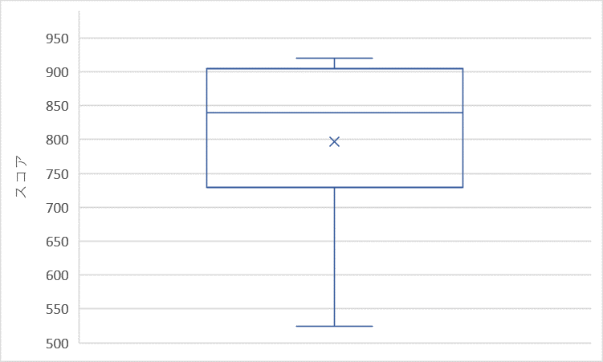

はじめまして、学部4年の鈴木です。

11月のブログ担当ですが、1月の下旬に書いています。

今は絶賛卒業研究でお取込み中ですが、その最中にブログを書くことになってしまいました。

2023年はコツコツ計画的に行動できるようになります！

11月のテーマは「研究室メンバーの英語スコア」について取り上げます！

これは、幸いなことに弊研究室は他大学から院生として入学を希望される方がとても多いため、これから弊研究室を志望する方々にとって参考になるのではないかと思ったからです。

調査は1月某日にたまたま研究室にいた研究室メンバーに口頭でTOEICのスコアを聞くという形で行いました( n = 9 ※うちスコアを覚えていない人1名、受験したことない人1名)。

調査結果を箱ひげ図として出力してみました（次の図）。

調査の結果、平均スコアは797±138となりました。

最大値は920、最小値は525(五・二五事件)であることからも、かなりスコアの幅が広いことが分かっていただけると思います。

11月のブログは研究室の英語スコアに注目してみました。

高橋・狩川研を志望する方々の参考になれば幸いです！

以上です！
