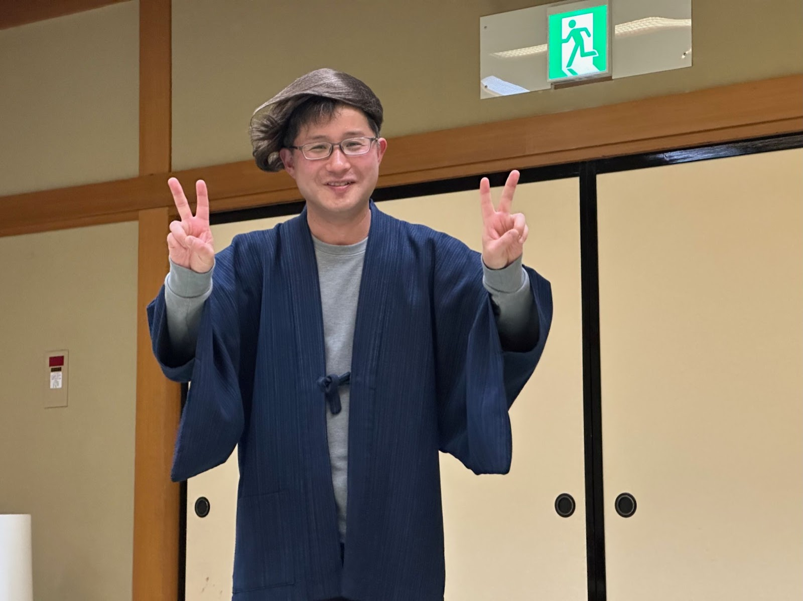
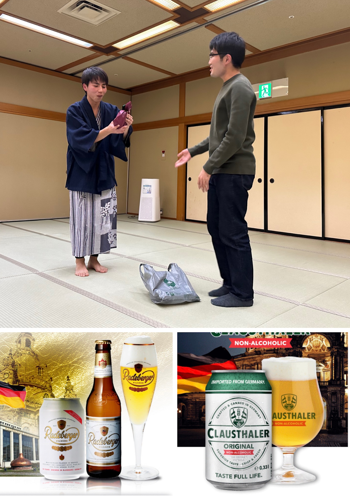
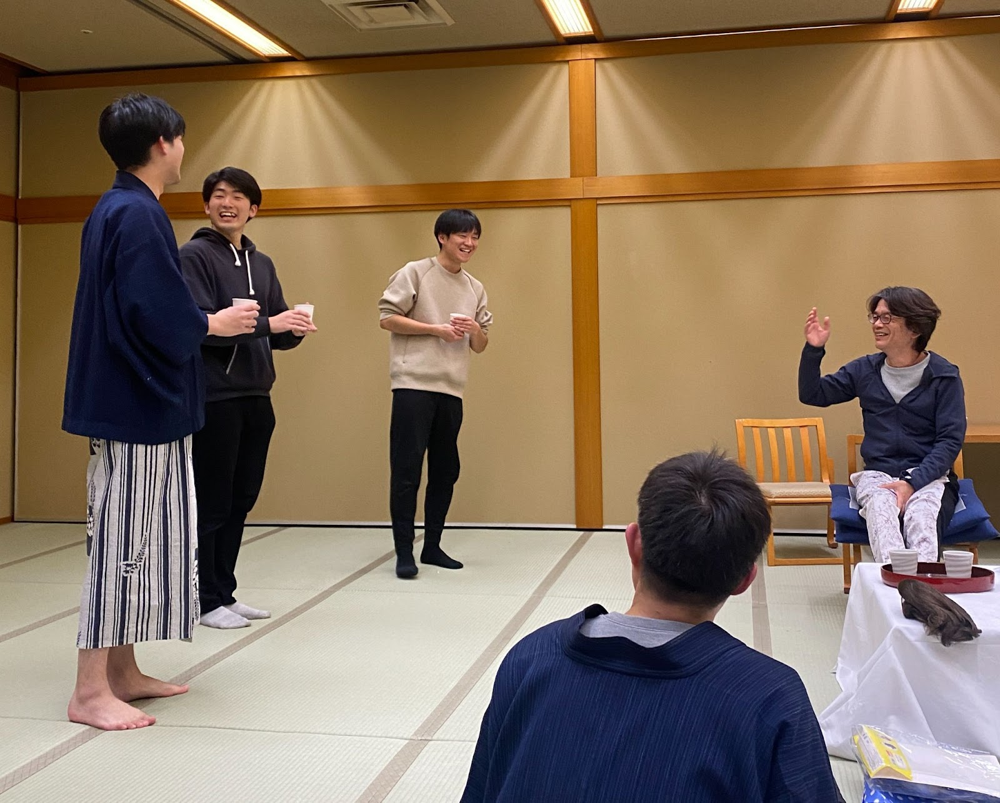

こんにちは。修士2年の森です。

今年度から始まったブログ更新頑張ろう企画。

開始当初から更新が遅れ始め、今や約2ヶ月の遅れが発生しています。人間、強制力のない状況下においてはこれ程までに怠惰になるのかと、再認識させられますね。

それでも2ヶ月の遅れにとどまっているのは、ブログ係島貫くんの尽力の成果です。この1年「ブログ書いてください」という言葉を何度も耳にしました。彼は頑張っています。今後とも高橋研のブログを宜しくお願いします。

さて、12月はというと、毎年恒例の忘年会が行われました。

去年と同様、『アクティブリゾーツ宮城蔵王』に宿泊し、忘年会を満喫しました。

高橋研の忘年会では毎年、プレゼント交換が行われます。テーマが設定され、テーマに沿ったプレゼントを持ち寄り、交換する企画です。

今年のテーマは『インフレ/円安』

なぜこんなにも暗く、連想の難しいテーマになったのでしょう。(テーマは投票によって決定されました。民主制はときに、誤った選択をしてしまうことがあるようです。)

私が在籍していた4年間で、1番悩まされました。

優勝したのはM1の木村くんが持ってきた、ドイツ産のビール「ラーデベルガー」と「クラウスターラー」でした。インフレといえば、第一次世界大戦後のドイツのハイパーインフレ、、らしいです。教養の高さに感服いたします。おめでとうございます。

プレゼント交換の後は、M1の佐藤くん主催の、『高橋教授格付けチェック』が行われました。

さすがは我が研究室教授。格の違いを見せて頂きました。

以上、12月の研究室ブログでした。

我々M2は今年3月で卒業します。とても楽しく、充実した4年間を過ごすことができました。有難うございました。

卒業後もブログが更新されるのを楽しみにしています。
