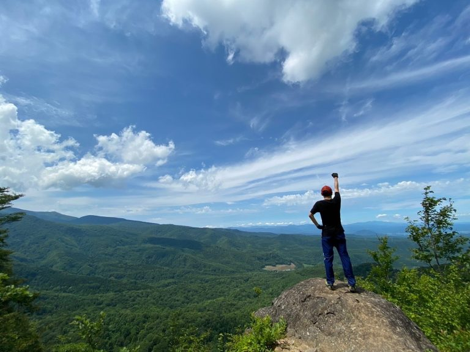
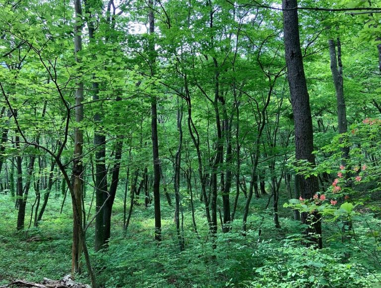
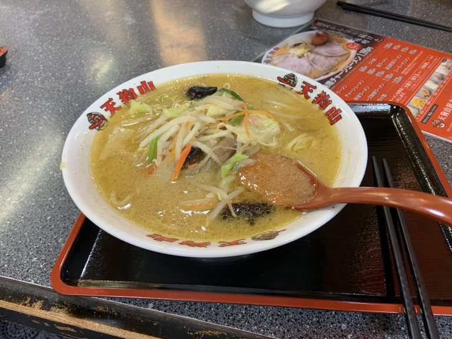
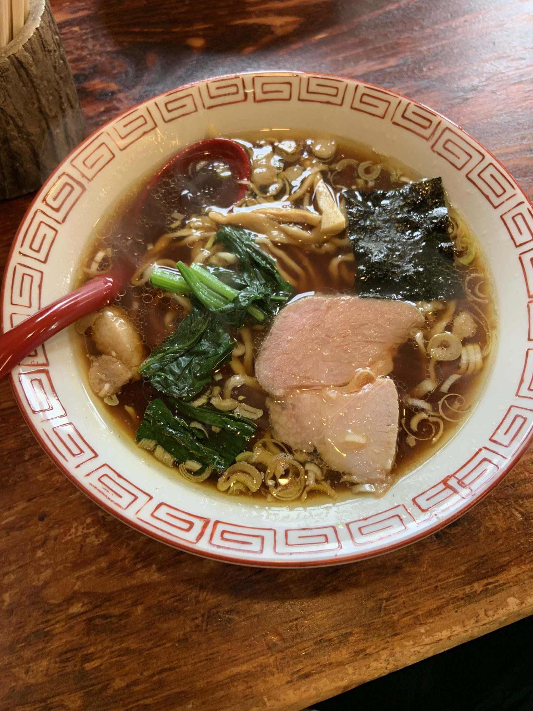
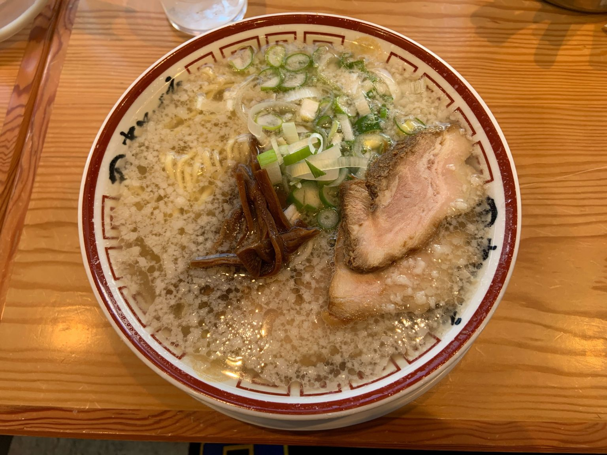

どうも！留学に行ってたため卒業を半年伸ばしたアメリカ帰り修士2年の市川です。

修論に追われてほぼ徹夜、顔面蒼白な同期を見るのを楽しみに帰国したら、、、余裕で終わってました。きっと涙ちょちょぎれる謝辞を書いてくれたことでしょう。ランチタイムには社会人で住む場所を楽しそうに決めてます。優秀な同期です。

さて高橋狩川研究室には登山部というグループがあります。高橋先生(教授)をリーダーとして月に2-3回登山に行きます。宮城県の山々をはじめ過去には秋田県鳥海山まで行ったことがあります。山が教えてくれる自然の壮大さであったり、神秘性が僕は好きです。デジタル社会で疲れ切った心をいつも癒してもらってます。

あとは強靭なメンタルが手に入ります。これいつ帰れるんだろと思いながらも、途中でギブアップできないので歩くしかないです。痛くても辛くても歩き続ければ帰れるということを繰り返してると、いつの間にかギブアップという概念はあなたの中から消えていきます。なんと素晴らしいことでしょう。

そしてなんと言っても1番の見どころは山登り後に先生にご馳走してもらえる一杯のラーメン。宮城の店を知り尽くした先生のラーメンは間違い無いです。

一緒に美味しいラーメン食べましょう
