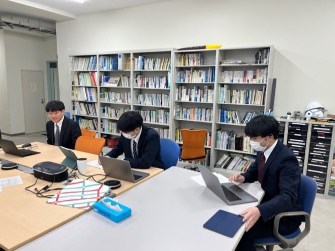
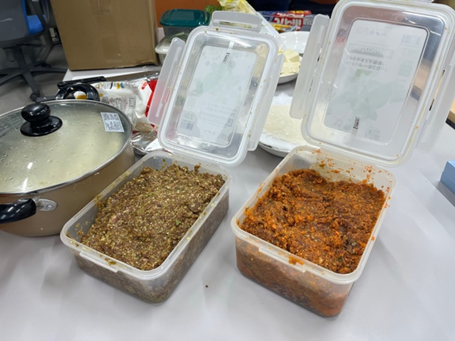
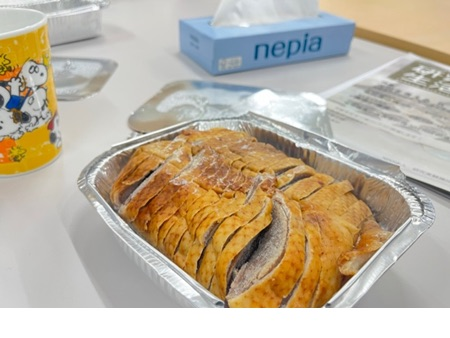

こんにちは。2月担当のM1本田です。

そろそろ花粉症の季節が到来しますね！

今年は花粉の大量飛散が見込まれる所が全国的に多いため、このブログを読まれている方で花粉症をお持ちの方は特にお気をつけて！

さて、2月といえばなんといってもM2の修士論文発表とB4の卒業論文発表がありました。

発表前は緊張している面持ちでしたが、無事に終わり安堵の表情で満ち溢れていました。

発表された方々、本当にお疲れ様でした！

来年は僕たち現M1と現B3の番ですね。

頑張りましょう！

また、もう一つのイベントとして、餃子＆北京ダックパーティーも開催されました。

餃子は、生地と2種類のタネをチョウさんが作ってきてくれて、その後の工程は中国出身の3人を中心として研究室メンバーで和気藹々と作りました。

日本にいながらここまで本格的な中華料理に思わず舌鼓を打ちました。

このように研究室内でよく同じ釜の飯を食べて、メンバーの親睦を深めています。

さて、今月はこれくらいにして、今学期ラスト3月担当M1の木村君にバトンを渡したいと思います。

ぜひお楽しみに！
