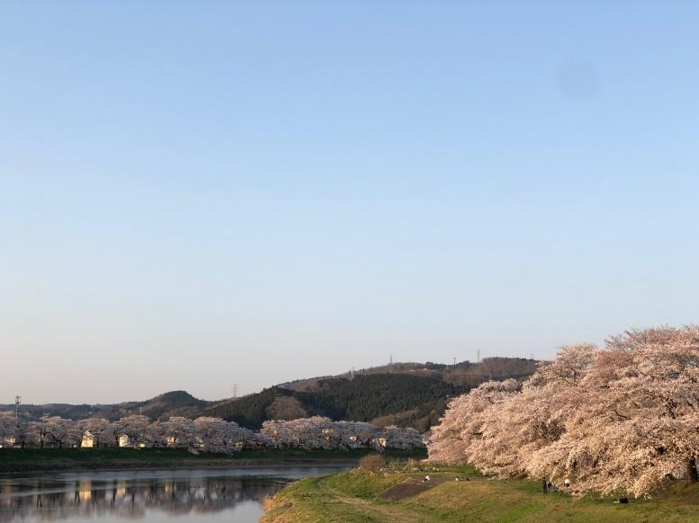
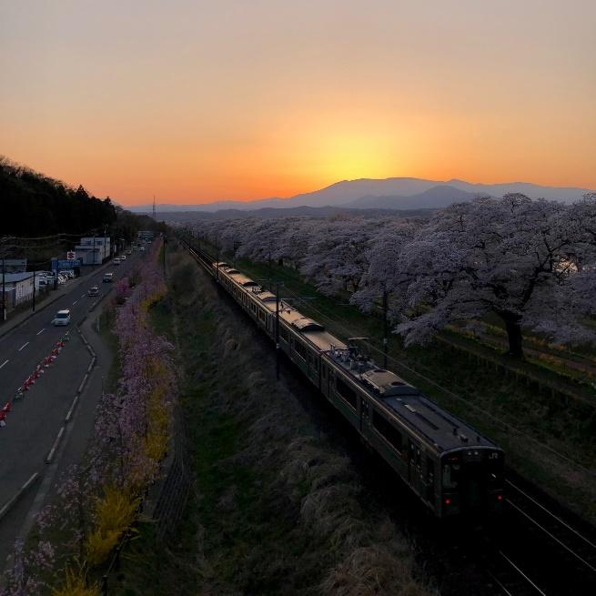
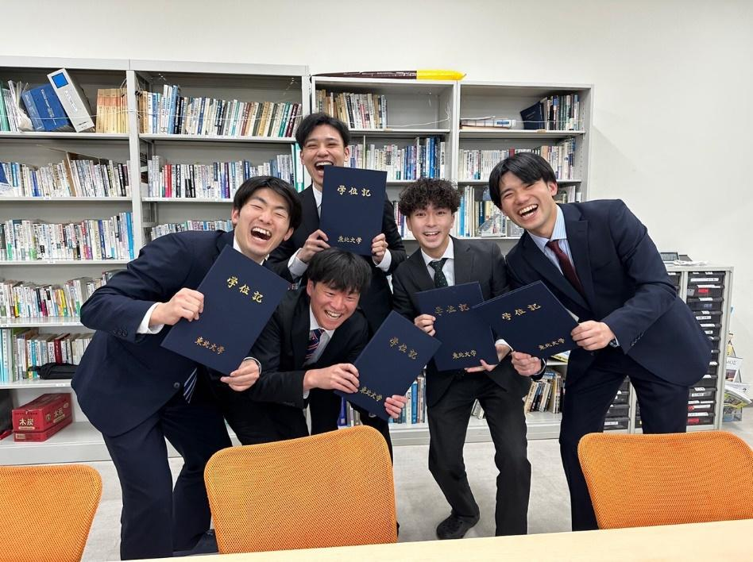
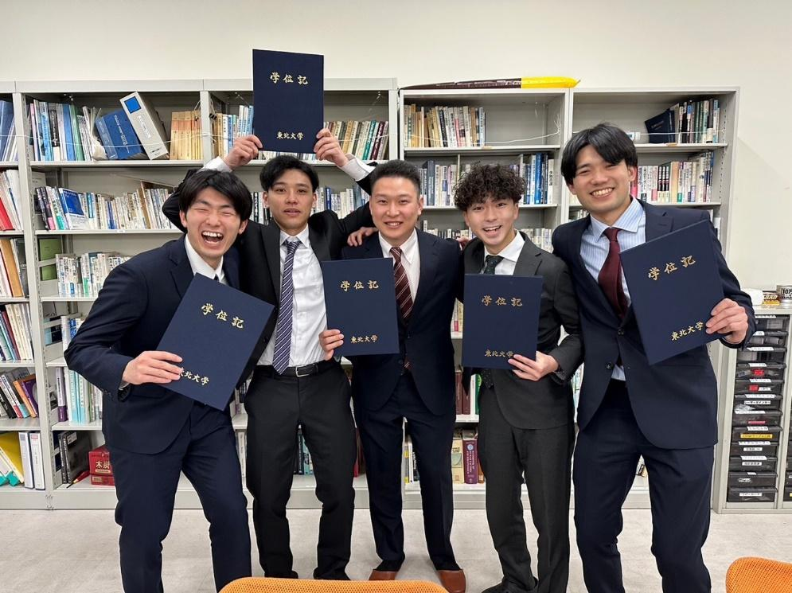
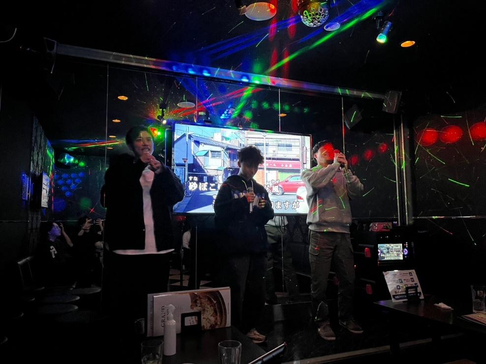
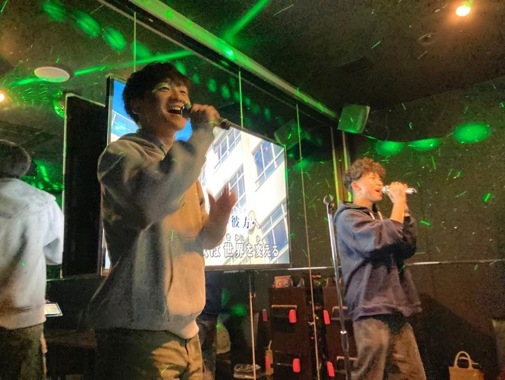

おばんです！

修士1年生だった、木村です。3月中に投稿するはずでしたが、もう4月…

ごめんね、ブログ担当の太一、読者のみなさん… (M1みんな遅れて書いてるじゃんとか突っ込まないでください。)

冬の間のどこか寂しかった景色にも次第に鮮やかな彩りが加わり始め、街行く人々の装いも日に日に軽さを増していく今日この頃。

仙台でも、観測史上最早での桜の開花が去る3/26に発表されました。

筆者はちょうど今日、白石川堤の一目千本桜を観て参りましたが、ちょうど満開。思わずうなってしまうような素晴らしい景色でした。

そしてそんな美しい景色の裏では、

飛び交う、花粉、花粉、花粉、花粉、花粉、花粉、花粉、花粉…。

花粉、花粉、花粉、花粉、花粉、花粉、花粉、花粉、花粉、花粉…。

あああああああああああああああああああああああああああ、つらい。

飛散量はピークに向けて増加中。ヒノキに移行した関東以西とは異なり、仙台ではまだスギ中心です。

苦しんでいる方々、一緒に頑張りましょう。

閑話休題。

この季節と言えば、出会いと別れ。

出会いについては4月のブログ担当に譲るとして、高橋・狩川研究室においても修士2年生が3人、学部4年生が3人(うち2名は進学して研究室に残る)の計6名が門出を迎えました。みなさん、清々しい笑顔で素敵ですね。

今まで大変お世話になりました。新しい場所でのご活躍も研究室一同、切に願っております。

さて、卒業式は3/24にゼビオアリーナ仙台で挙行されましたが、研究室ではその前日夜に追いコンを開催しました。

一次会では、卒業するメンバーと歓談。

毎年恒例、在学生から卒業するメンバーへ寄せ書きが贈られました。また、卒業生それぞれに向けてピッタリな一冊も贈られました。

4月からは新メンバーがたくさんいらっしゃると聞いていますので、新年度を迎えた新しい高橋・狩川研究室も楽しみですね。

そういえば、学部新4年や高専専攻科新２年の皆さんにとって、この時期は大学院の出願をどこにしようかなんてことを考え始める時期なんじゃないでしょうか。

かくいう私自身も他大学からやって参りましたので、2年前はそんな状態でした。

本研究室に興味を持っていただき、このブログに辿り着いたみなさん。安心してください。外部からの受験生も多い研究室となっていますし、先生方も研究室メンバーも優しさと個性に溢れていますので、充実した楽しい研究生活を送りやすい場所になっているかなと思います。研究内容としても、詳しくはHPや過去のブログなどをご参照いただきたいのですが、あまり他の研究室ではやれないようなテーマについても実践的に取り組めます。

気になった方はぜひ、一度研究室見学にいらしてください。

また、外部からの受験の際の不安や研究内容などは先生や、私も含めて学生にメールしていただければ相談に乗りますので、ぜひお気軽にどうぞ。(研究室HPに連絡先があります)

ではでは。
